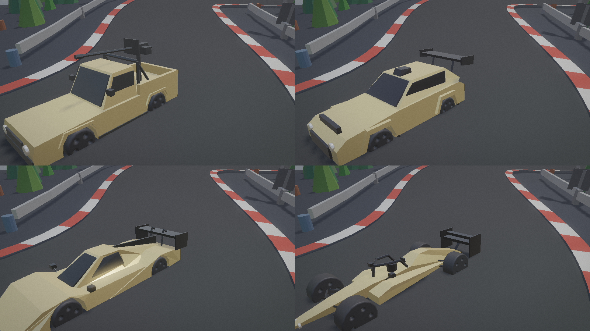
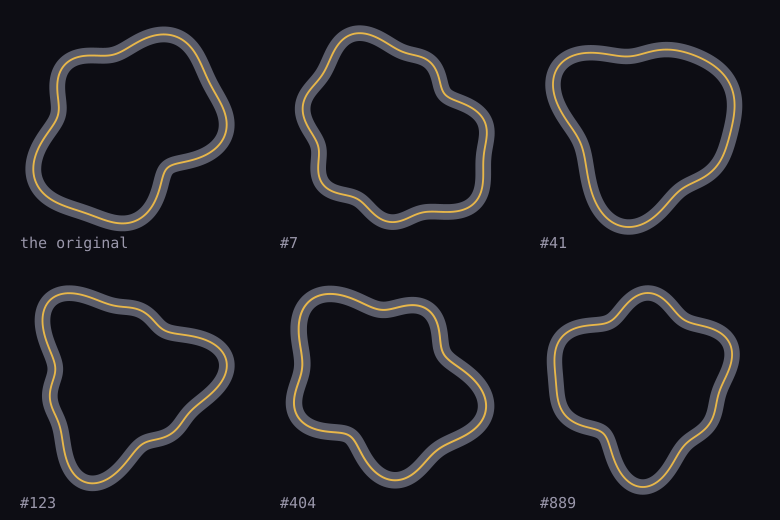
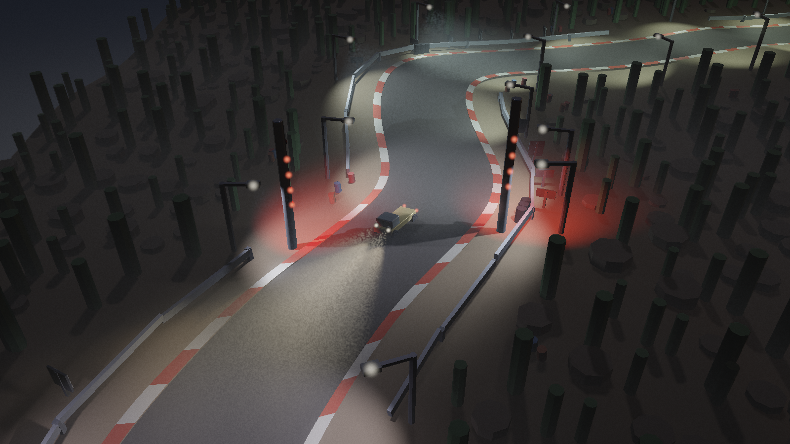
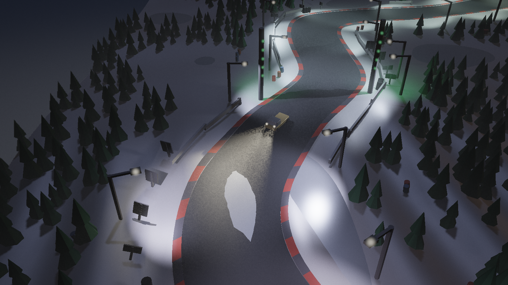
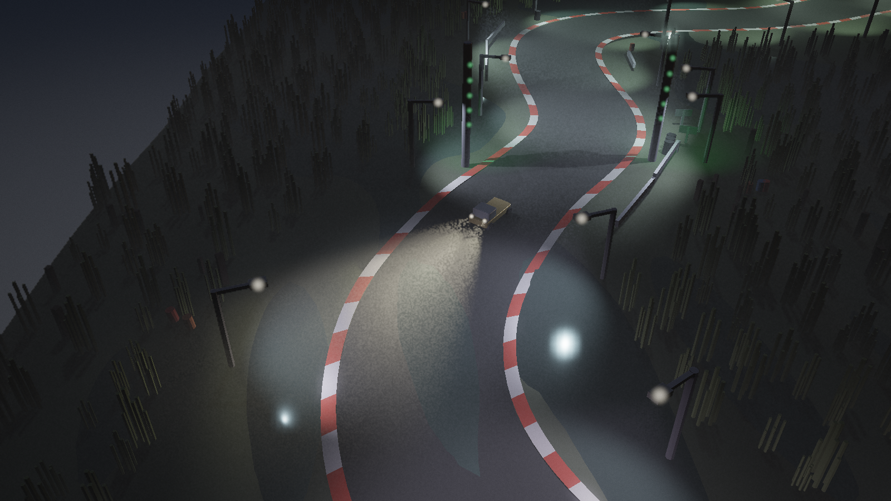
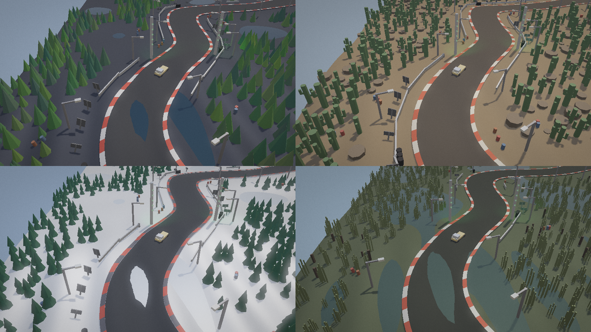

# Arena

A night circuit, on the game path of
[artshape-render](https://github.com/onion2k/artshape-render): drive a truck
round a lit track over rolling ground against three others, and try to take a
second off your best lap.

It was an arena shooter until the driving turned out to be the more
interesting half. The drones, the gun and the score are gone; the vehicle they
were standing on — suspension, tyres, and a floor with hills in it — is the
whole game now.


## Running it

```bash
npm install && npm run dev
```

Needs a browser with WebGPU.

| | |
| --- | --- |
| **A** **D** or ← → | steer |
| **W** or ↑ | throttle |
| **S** or ↓ | brake, and reverse once stopped |
| **R** | back to the line |
| drag | swing the camera round |
| wheel | in, or out until the whole circuit is in frame |
| **C** | put the camera back |

### Tests

```bash
npm test
```

No browser: the circuit, the ground, the water, the vehicle and the race are
all CPU, and `circuit.ts` builds a circuit exactly as the page does without a
canvas in sight. `src/__tests__` drives a vehicle round one with a script and
checks what happened.

Two kinds of test. The **recordings** are snapshots: what `useTrack` lays out
for every size and biome on two circuits — props, posts, rails, bollards,
how deep the water came out — and a hash of where the vehicle was after every
frame of a 34-second scripted drive, for each class and a spread of circuits.
A change meant to leave the driving alone must leave every hash alone; one
meant to change it updates them with `npx vitest -u`, and the diff says which
runs moved. The vehicle refactor was checked this way by hand, against a
worktree at the commit before it, and the check went with the worktree; it
only ever drove seed 0 in the forest, which is how the fords draining on most
other circuits got past it. The **invariants** say what has to hold whatever
the numbers are: the water is as deep as the biome asks unless the grid would
be under it, and every class holds four wheels on the ground flat out at any
frame rate.

## The ghost

There were three rivals with a driving model of their own. They were
competent and they did not add much: a driver who is always about as quick as
you gives you something to bump into, and the question a circuit this size
actually asks is whether you took the last corner better than you took it
last time. So the field is gone, `racer.ts` with it, and what runs beside you
is a recording of the best lap you have driven — a harder opponent than the
AI was, one that gets harder exactly as fast as you do, and one that never
blocks the road.

**It is a recording, not a simulation.** A pose goes down thirty times a
second — where the body was, which way it pointed, and what each of the four
wheels was doing — and the replay reads between two samples, so a lap plays
back as smooth as the frame it is drawn in. A fourteen-second lap is 420
samples of twenty floats: 34KB, which is not worth being clever about.
Nothing is re-driven. The ghost cannot bounce off a post it hit last lap,
because it is not there: it has no collision, no momentum to trade, and it
lays no rubber and throws no spray, all of which belong to the truck that is
actually on the road.

**The recording starts at a line crossing and never at the grid**, which is
why no ghost appears until the second lap is done. A lap begun from a
standing start is not one you can compare against; worse, a lap recorded from
the grid runs its lap fraction backwards through the line before it starts,
and the fraction is the one thing the comparison needs. It keeps a lap only
if that lap beats the one it holds, so the ghost is always the best lap it
has seen — which after a standing start is never the first one.

**The gap is measured by where you are, not by when.** At the point of the
circuit you have reached, the recording says what the clock read when the
ghost got here; the difference is what the HUD shows, green when you are up
and red when you are down. Comparing at the same *time* instead would tell
you which of you was further round, which is the same information read the
hard way and no use at a corner. The two agree, which is worth checking: at a
delta of 0.29s and 1700 mm/s the ghost was 502mm up the road, and 0.29 × 1700
is 493.

**Seeing it in the dark** is the one thing the renderer makes awkward. There
is no transparency here, so the ghost cannot be the see-through thing a ghost
usually is. It is painted a cold pale blue no truck is painted, it carries no
lamps — a second set of headlights washing the road would be light from a car
that is not there, and would light the mist you are driving through — and it
wears four cold marker glows at the corners of its body. Four and not two,
because two points is a thing in the distance and four is a truck-shaped
thing, and which way the ghost is pointing going into a corner is most of
what you want from it.

R puts you back on the line and leaves the ghost alone: a restart is another
go at the same circuit, and throwing your best lap away because you pressed R
is not what R is for.

## The truck

It is a rigid body on four wheels, not a dot with a velocity. Every frame a
ray goes down from each wheel to find the ground; each wheel that finds it
pushes the body up through a spring and a damper, and that push is also the
load that wheel is carrying and so the size of the friction circle its tyre
has to spend. In that circle each tyre kills what sideways velocity it can and
drives or brakes along its own facing, and asking for more than the circle
holds is what makes a corner a corner. Everything is summed as force *and* as
torque about the centre of mass, so it dives, leans and pitches over a crest
without any of those being written down anywhere.

It steers rather than turning: the front wheels point, and a stopped car does
not rotate. Hold the brake once it has stopped and it reverses, which matters
more than it sounds — a car pushed straight back out of whatever it hits, and
unable to steer without moving, is wedged there forever otherwise. Space is
the handbrake, which is a different thing: it locks the back wheels and takes
most of their sideways grip, and is for pointing the truck somewhere other
than where it is going.

A wheel with no ground under it makes no force at all, so a jump is not a
special case: the springs run out of travel, the wheels stop pushing, and
gravity is all that is left.

It was too light, too slidy and too wide in a corner. What fixed each:

- **Light** was the springs. It sagged 13mm of its 26mm of travel standing
  still — half the suspension used up doing nothing — so the body floated and
  pitched at every input. At 305 it sags 8mm and a 60mm drop settles in 0.2s.
  Anti-roll bars took the lean out without taking the travel out, and the
  inertias carry a gyration factor, because a vehicle is not a uniform box:
  its mass is at the corners, and how long something takes to agree to change
  direction is most of what tells you it is heavy.
- **Slidy** was the tyres taking 90ms to decide, and not a shortage of grip.
  At 55ms they bite. Grip went up too, which mattered less than it sounds.
- **Short** it stayed until later. The wheelbase is 220 now and the body 300,
  a third longer between the axles than the 166 it was built with. A long
  wheelbase is a calmer truck and a wider turning circle, and the circle is
  the thing to watch: turn radius is wheelbase over tan of the road wheel
  angle, so 33% more wheelbase is 33% more radius on the same lock, and the
  circle at 1500 mm/s went straight from 443mm to 560 against a tightest
  corner of 568. That is no margin at all, and it is exactly the state the
  steering lock was raised to fix once before. Taking the lock from 0.62 to
  0.72 — 41 degrees at a standstill, the top of what a real rack gives — puts
  it back to 458/482/506mm at 900/1500/2100. The inertias are worked out from
  the body length, so lengthening it makes the truck slower to pitch and to
  change direction, which is most of what the extra length is for.
- **The turning circle** was the steering lock winding off too hard with
  speed. At 1500 mm/s it was leaving 0.116 radians, a 1426mm circle — wider
  than the tightest corner on the track, so that corner could not be taken at
  speed however much grip there was. It now keeps 0.23 radians and turns
  inside 800mm.

The brakes are deliberately weaker than the tyres. Grip alone stopped it from
full speed in sixty millimetres — a fifth of a truck length, in a tenth of a
second — which is not a brake but a wall, and it took braking out of the game
entirely: no corner had to be slowed for. Capped, it stops in 1.6 truck
lengths, and where to brake is a question again.

Together those took a lap from 8.65 seconds to 5.60, and the line-follower
that drives it from wandering 295mm off the centreline to 56.

### Then it turned out none of that was the limit

All of the above is about the car being heavy and precise, and it worked, and
the game still was not much fun to play. Measuring the thing nobody had
measured said why. On a full-lock skidpad at every speed the truck can reach,
it used **between four and fifteen per cent of the grip it had**, peaking at
0.31g of lateral acceleration against tyres worth 2.15. The tightest corner on
the circuit asks 0.87g at top speed. So the tyres were never the limit,
nothing could overdrive a corner, nothing a bump or a throttle did could
unsettle it, and the radius it turned in was decided by the steering geometry
alone. It was a slot car with a minimum radius, and the only input that
mattered was holding the wheel over and waiting.

Four things followed from that.

- **Grip came down to 1.35 and the steering falloff went up to 2600.** Full
  lock at 2200 mm/s now asks for 1.03g against the 1.35 the tyres have. Peak
  lateral went from 0.31g to 0.76 and grip use from 4–15% to 26–56%: the
  driver can ask for more than the car has, which is the only way a limit can
  be something you drive to. It cannot go much lower while the engine is this
  strong — the rear tyres have to be able to put 5800 down, and at 1.05 they
  could not, so a field of four spent 91% of a race stationary and spinning
  its wheels.
- **The rear tyres get 92% of the front's grip**, so the back lets go first
  and lets go progressively, and there is something to catch.
- **`gripAt` was wired in.** It had been sitting in the track module, fully
  written, called by nothing: the grass gripped exactly as well as the road. A
  racing line you are not punished for missing is not a racing line. It takes
  a third of the grip away over a 200mm shoulder, and off-track rolling
  resistance takes speed as well — needed because on a track defined as a
  radius about a middle, cutting the inside makes the lap *shorter*, and the
  fastest of the AI drivers, back when there were three, was doing exactly
  that for a fifth of every lap.
- **A handbrake**, on the space bar, which is the one input that is not a
  request for more of something.

The measured result, over a two-minute four-car race: every car finishes, best
laps 14.18 to 14.82 seconds, no spins, no car stationary at any point, and
10.7% of the time with a wheel off the road. Solo, the four skill levels
separate by 1.7 seconds a lap.

### Drifting

Brake while turning, at speed, and the back steps out; keep the wheel
turned and the throttle on and it stays out until the wheel centres. That
is the whole input. Underneath it is the handbrake's mechanism — the rear
tyres give up grip, faded out with the slip angle so an angle cannot become
a spin — with a latch that outlives the tap, and one thing that is not
tyres at all: a servo on the slip angle, a yaw torque in the steering's
direction that runs out at an angle the steering sets, with damping against
the yaw rate. It is the one arcade assist in the physics, and measuring is
what made it necessary.

With the wheel held at full lock into the corner — the only way a keyboard
holds it — the truck rotates until its front tyres point along the way it
is going, and then they stop pushing: the body's slip settles at the lock
less the yaw's share, about 13 degrees, however little grip the rear has.
Cutting the rear from a fifth of its grip to a twentieth moved that by one
degree. A driver goes past it on opposite lock, and a keyboard cannot, so
the servo does the rotating instead and the fronts, pointing into a corner
the truck is going out of, hold it there. A fixed torque was tried first
and was either too little — the fronts are stiff, three degrees of slip is
force enough to cancel a kick of 24 — or too much, and the momentum carried
the truck through 150 degrees before the fade could catch it. Full torque at
no slip, none at the target, capped at 110 so a tap is a flick and not a
slam.

Measured, a brake tap of a quarter second at full lock then throttle with
the wheel held: peak slip **22 degrees** against 11 without the tap, held
between 10 and 19 under the throttle, no spin at 1200, 1700 or 2200 mm/s,
back straight in under a tenth of a second when the wheel centres, and the AI
drivers, while there were any, never triggered it — zero drift frames and
zero marks from them in ninety seconds. It costs speed: the tap and the sideways scrub take the
truck down to 330 to 500 mm/s before the throttle brings it back, which is
what drifting costs a real car and is why nobody drifts to win. Nine
tunings got here, and the thing they kept finding was that the truck's
speed, not its angle, was what ended a drift: sideways at 38 degrees it
fell through its own speed gate in half a second, so a drift that is
going holds down to 300 where one may only start above 900.

### Rubber on the road

A sliding tyre on the tarmac leaves a mark: a thin dark quad from where the
wheel was to where it is, in a ring of two thousand — thirty-odd seconds of
sliding — with the oldest overwritten. They are an ordinary instanced group
with the darkest matte material in the arena, so they take the floods and
the shadows like everything else. Only on the tarmac, and never wet: a tyre
on the shoulder throws dust, and a tyre in a ford throws spray. A drift
round one corner lays about eighty. The smoke that goes with them was
already there, since the particles: a sliding tyre smokes.

### The handbrake is not a fast way round anything

It was swept over how much sideways grip it leaves the rear and how hard it
locks, and it never once turned the truck through more of a corner than
steering did: cutting the rear's sideways grip cuts the rear's share of the
cornering with it, so the truck rotates and runs wide at the same time. What
it buys is 45 degrees of slip angle that comes back the moment you let go,
for three quarters of the speed carried in. That is what a handbrake turn
costs a real car too, and it is kept on those terms.

Getting there took three wrong tunings, each of which is recorded in the
source where it matters:

- Left alone the handbrake took **99% of the speed away in seven tenths of a
  second** — a parking brake, not a drift. Its longitudinal force is capped
  now.
- That was also why it looked random. With the truck nearly stopped, any
  rotation at all reads as a slip angle of 180 degrees, so the same key gave a
  tidy 42-degree slide at full lock and an apparent spin at three quarters.
- Fading it out on the yaw rate rather than the slip angle sounded better and
  measured worse. It is on the slip angle, with full grip back by 60 degrees —
  well inside the 90 past which a tyre stops arresting a spin and starts
  feeding it, because once the truck is travelling sideways the direction its
  contact patch is sliding is along the truck rather than across it.

### The drivers, and why they went

There were three of them, in `racer.ts`: an opponent followed the centreline
offset by a line of its own, steered for a yaw rate rather than for a heading
error, and aimed at a point corrected outward by the sagitta of the chord it
was driving — a driver steering straight at a point on an arc passes inside
that arc, 178mm of a 380mm half-width at the tightest corner here, and that
correction took the fastest car from spending 20.9% of its lap off the road
on the inside of every corner to 9.7%, and the other three to zero. They ran
six laps in ninety seconds, best 13.6, none of them stalling.

All of which was true and none of which was interesting to drive against.
They are gone, and a recording of your own best lap runs in their place: see
[The ghost](#the-ghost). What they left behind is in the numbers above — the
shoulder grip, the drift tuning and the racing line were all measured against
them, and those measurements stand even though the drivers do not.

### Four vehicles

**Technical, rally car, Le Mans prototype, F1 car — a button on the
track-select screen, beside the size.** Everything above this heading is the
technical exactly as it was: every number in it moved out of bare module
constants and onto a `VehicleSpec` (`vehicle.ts`/`vehicles.ts`), read in
place of the constant it replaced, in the same order, with nothing about the
arithmetic changed. Checked by more than reading it back — a script drives
four seconds of countdown and thirty seconds of a fixed input (full
throttle, a sine wave on the wheel, a brake tap every five seconds) and
hashes position, heading and speed every step; the hash from before the
change and the hash from after it are the same number, `562148294`.

A class is a full spec of its own, not a multiplier on the technical's: body
size, wheel layout, suspension, tyre grip, engine power and top speed, drift
and handbrake behaviour, steering lock, inertia, a collision radius, and its
own kit of meshes. The physics generalises the one thing that used to be
hardcoded rear-wheel drive — `engine.driveFront`, 0 for all-rear, 1 for
all-front, 0.5 for a 50/50 split — and everything else is a straight
per-class number where the technical had a constant.

| | technical | rally car | Le Mans prototype | F1 car |
| --- | ---: | ---: | ---: | ---: |
| body, L×W×H | 300×128×90 | 260×120×80 | 340×130×62 | 360×110×48 |
| drive | rear | all-wheel | rear | rear |
| top speed | 2300 | 2500 | 3000 | 3300 |
| grip (μ) | 1.35 | 1.45 | 1.70 | 1.95 |
| suspension travel | 26 | 34 | 18 | 12 |
| collision radius | 98 | 90 | 105 | 110 |
| corner / accel / brake rating | 61 / 700 / 2400 | 73 / 785 / 2627 | 69 / 852 / 2915 | 71 / 1018 / 3383 |
| par factor | 1.086 | 1.058 | 1.132 | 1.171 |
| par lap, seed 0, medium | 13.7 s | 12.3 s | 11.0 s | 10.3 s |

### Benching the three new classes

The cornering, acceleration and braking numbers that feed the lap rating
(`rating.corner/accel/brake` — see [How hard is it](#how-hard-is-it)) are
now a bench result, `bench.ts`, for all four classes — the three new ones
were a guess before this.

Benching found two bugs in the bench before it found any numbers. First:
driven down the shipped circuit's own straight for the run, every class's
acceleration swung through thousands of mm/s² from one sample to the next,
because that straight is not flat — it rides `terrain.ts`'s swell and ramp
waves, and the suspension was reporting them back exactly as it should.
`setBenchFlat` takes the ground out of the way. Second: a full-throttle run
long enough to reach top speed covers ground `where`'s polar offset was
never meant to answer for on a loop a few metres across, and reads as
running wide within a few seconds — `setBenchGrip` holds grip at 1 for the
run instead.

*(This paragraph turned out to be wrong: see [A step is a
120th](#a-step-is-a-120th).)*

A third thing surfaced once those two were out of the way, and it is not a
bench bug: held dead straight at full throttle for long enough, every
vehicle here — the technical too, untouched by any of this — settles into a
sustained pitch-and-heave oscillation that does not damp out, tens of
millimetres of ride height and tenths of a radian of pitch, sample to
sample. It is a real mode of the suspension, excited by a perfectly
symmetric, perfectly sustained input gameplay never actually supplies — a
human corrects a line rather than holding millimetre-straight for twenty
seconds, and the real terrain's bumps are irregular rather than tuned to
the resonance. Fixing the mode is out of scope here; the bench instead
measures quantities an integral is robust to it, rather than an instant
reading. Accel and brake are `v² = u² + 2as` over a window wide enough to
span several cycles of it, which averages the oscillation out rather than
sampling whatever phase a run happens to end on. Corner turned out to want
a different fix again: held at a *fixed* speed, the same oscillation (or a
throttle servo fighting it) corrupted the reading; run instead at full lock
and a fixed, moderate throttle with nothing held constant, every class
settles cleanly — no oscillation at all, cornering hard turns out to be
exactly the asymmetric input that damps the straight-line mode out — onto
its own steady circle, and that settled speed is what gets sampled.

None of this reproduced the technical's own shipped rating: benched the
same way, it reads nearer `55` / `3090` / `5500` against its shipped
`61` / `700` / `2400`. That gap is not a bug in either number — `rateTrack`'s
own comment says its ideal-point-mass lap is checked against real driven
laps and runs 8 to 16% quick, and a rating tuned down from the raw physics
toward what a lap actually takes is exactly what that comparison would
produce, which this bench cannot redo without twenty real recorded laps to
check against. So the three new classes are not rated at the raw bench
number: each is scaled by the same factor the technical's shipped rating
already carries against its own bench result — corner ×1.113, accel
×0.227, brake ×0.437 — the only calibration available to check this bench
against at all.

*(So did this one, for the same reason.)*

One finding worth keeping rather than tuning away: the F1 car's benched
corner rating, 54.3 raw, comes out barely above the technical's own 54.8
despite having by far the most tyre grip of the four (μ 1.95). The bench
holds every class at full lock at roughly half its own top speed, and at
the F1's own settled 1559 mm/s there its steering — the tightest lock and
the widest fall-off of the four — has already wound off most of what it
had, and its 276mm wheelbase widens the geometric circle on top of that.
This class is limited by its own steering geometry at that speed, not by
what its tyres could hold — which happens to be true of a real F1 car too:
fast in a flowing corner, not nimble in a hairpin. It is why the Le Mans
prototype, not the F1, has the shortest par lap on the tight, original
circuit above.

**A kit is always the same shape.** One painted body — the thing that takes
the gold-or-blue tint the player and the ghost are told apart by — one
unpainted detail part, a wheel, a headlamp. Every class draws exactly two
vehicle-shaped dynamic groups regardless of which one is in force, so
changing class is `renderer.setDynamic` handed new meshes into the same
pools — the same operation the arena already does for a new circuit's
static half — and not a change to how many buffers exist or how big they
are. Each kit carries its own lights — headlamps, brake glows, the exhaust
glow and the ghost's corner markers — placed on its own model, and a test
holds every one of them to that model's bounds, headlamps at the front and
tail lights at the back.

**The models** (`models.ts`) were a card-shaped plate each with one block on
it. They are built now from a few simple solids merged into the two groups
— a side profile swept across the car with a half width at every point, so
a roof can be narrower than a sill; a plan outline swept up, for wings; a
rod between two points — round each class's real wheels, at the ride height
it settles to:

- **The technical** is a crew-cab pickup: a long bonnet, a raked windscreen,
  flared arches, an open bed, a roll bar behind the cab and a heavy machine
  gun on a pedestal in the bed with its barrel over the roof.
- **The rally car** is a World Rally hatchback: blistered arches, a sloping
  hatch, a roof scoop, a rear wing on stalks, a splitter, a light pod and mud
  flaps behind every wheel.
- **The Le Mans prototype** is a closed endurance car: a low nose between
  high fenders, a teardrop canopy, a shark fin to a rear wing on swan necks,
  a splitter and a straked diffuser.
- **The F1 car** is open-wheeled: a needle nose off a full-width front wing,
  a survival cell with a halo, pinched sidepods, an airbox, a high rear wing,
  a helmet in the cockpit and wishbones out to every wheel.

The models are only what is drawn: the physics' body box, wheels and
collision radius are untouched, and every recorded trajectory is the same.



Switching class clears the ghost, the same way a new circuit does and for
the same reason: a lap belongs to what was driven as much as to where.
Switching keeps the road you are on — only the seed or the size rebuilds the
arena; the vehicle is a mesh-and-physics swap on top of it.

### A step is a 120th

The race used to step by whatever the frame took, and the vehicle integrated
each step in quarters. So a 60Hz display ran the suspension at a 240th of a
second, a 144Hz one at a 576th, and a frame that hit the loop's own cap of a
twentieth at an 80th. Nothing in the technical minded. The new classes did.

The body is integrated explicitly — velocity from force, then position from
velocity — and a damper under that is only stable while its rate times the
step is under two. The fastest mode here is roll: four dampers at the wheels'
distance across the body, over the body's inertia in roll, `rollDamping` in
`vehicle.ts`. That is 136 a second for the technical, 160 for the rally car,
207 for the prototype and 448 for the F1. At a 240th the F1 is at 1.87, and
the springs take it the rest of the way.

What it did was not a wobble. The whole load jumped from one side of the car
to the other every substep — two wheels carrying all of it and two nothing,
then the other way — with the body flicking two thousandths of a radian
either side of level. Four substeps a frame is an even number, so every frame
landed on the same side: a car sitting level, on two wheels, with the tyres
on the light side sliding. Flat out on the flat, fifteen seconds, stepped as
the game stepped it:

| | 20Hz | 30Hz | 45Hz | 60Hz | 90Hz+ |
| --- | ---: | ---: | ---: | ---: | ---: |
| technical | 2193 | 2193 | 2193 | 2193 | 2193 |
| rally car | **1710** | 2386 | 2386 | 2386 | 2386 |
| Le Mans prototype | **1973** | 2874 | 2874 | 2874 | 2874 |
| F1 car | **784** | **1452** | **2275** | **2275** | 3183 |

In bold, on two wheels. The theory predicts every cell: each class goes over
where its damping rate times a quarter-frame passes two.

This is what the bench above took for a pitch-and-heave mode. The bench
stepped at a sixtieth, so it drove the F1 on two wheels for all three of its
measurements, and the "finding" that the F1 corners barely better than the
technical was the car doing it on half its tyres. Re-benched, its corner
number is 63.9 and not 54.3, and its steady circle is taken at 1885 mm/s and
not 1559; scaled the same way as before, its rating is 71 / 1018 / 3383
rather than 60 / 1015 / 3410, and its par on the original circuit is 11.3 s,
the quickest of the four, not 12.7. The other three classes moved by under
1.5% and are left as they were. Nothing like the oscillation reproduces in
the technical, the rally car or the prototype on the flat, at the old step
or the new.

Two changes. **Substeps are a 480th at most** (`SUBSTEP`), however long the
step that asks for them: the F1's roll is then 0.93, half the limit, and a
test holds every class's `rollDamping` under that bound, so a stiffer class
arrives with a failing test. **The race steps in 120ths** (`STEP`,
`FixedStep` in `game.ts`), whatever the frame took, carrying the remainder
to the next frame. That is four substeps a step, which is exactly what a
120Hz display always got — and every display now runs the same race: the
tests drive a race at 20, 30, 60, 120, 144 and 240Hz and get the same state,
bit for bit, after the same number of steps.

The price of stepping in whole 120ths is that the physics is up to a step
behind the frame, and at 144Hz one frame in six takes no step at all. Drawn
from the physics, that frame repeats the one before it — 24 frames in 144
stood still in the test, before the fix. So nothing is drawn from the physics
any more: `Race.shown` is read between where the truck was before its last
step and where it is now, as far as the frame has got toward the next one,
and the body, the wheels, the lamps and their beams, the glows, the camera
and the minimap all read that. The ghost is read at `shownLapTime`, the lap
clock at the same instant, so it does not run a step ahead of you. Speed,
slide and each wheel's own state still come from the vehicle, where the
physics is.

The F1 is not done being strange. With the step fixed, on real ground at
speed its load still swaps between diagonal pairs of wheels — front left and
rear right, then the other two — but that one converges: a 1920th gives the
same pattern as a 480th to within a few newtons. It is what twelve
millimetres of travel does on ground with hills in it, and it is tuning, not
a bug.

## Generating a circuit

The circuit is a polar curve — a radius that varies with the angle — and that
form is what makes a generator possible at all. Every term is a whole number
of cycles round the loop, so the curve closes for free; there is no way to
draw a shape that does not join up, and no way to draw one that crosses
itself. What is left is choosing amplitudes and phases, which a seed can do.

**The hard part is that random harmonics make a closed loop every time and a
good one only sometimes.** Too much amplitude in a high harmonic and there is
a corner tighter than the truck can turn; too much in any of them and the
radius runs so steeply that it is barely across the track at all, which puts
the trackside posts on the racing line — the same geometry that once had a
post 437mm from the centreline when its clearance said 640.

So the generator proposes and then measures, and if the measurement fails it
repairs the proposal and measures again. Repair always terminates — every
route out of a fault ends at a circle, and a circle passes everything — so it
cannot hand back something broken.

**The repair is aimed, and that is most of where the variety comes from.**
Scaling every amplitude down fixes anything, but it fixes the shape as well
as the fault: a circuit with one corner too tight came back as a gentler
version of itself all over, and forty seeds in a row produced the same
rounded blob at different rotations. Curvature goes as `amp * k²`, so a
corner that is too tight is nearly always the highest harmonic's doing, and
taking it out of that one term leaves the low harmonics — which are the shape
of the circuit — alone. A radius out of bounds moves `r0`, which is what sets
them. A radius running along the road rather than across it is a first
derivative, `amp * k`, so that comes out of whichever term is worst by that
measure. Only a loop wider than the arena however it is centred brings
everything down together.

The proposal got bolder to match: a first harmonic in the draw, which pushes
the whole loop off centre and gives a circuit one long side; harmonics up to
eight, which put a corner between two corners; a fourth term 45% of the time;
and amplitudes drawn through a power rather than flat, so most circuits have
one term that dominates and the rest decorate it. Three harmonics of equal
weight average out into a circle, which is what a flat draw kept producing.

What it measures, and the bar, which is `CLASSIC` — the circuit the game
shipped with — at 29,099mm a lap, a radius from 2,775 to 5,148, a tightest
corner of 638 and a worst radial-to-across of 0.672:

| | limit | why |
| --- | ---: | --- |
| tightest corner | 600mm | the truck's circle is 486 at 1200 mm/s |
| radius | 2,500–5,300 | inside it crowds the middle, outside it leaves the arena |
| radial-to-across | 0.62 | under this the posts stand nearer the road than their clearance says |
| lap length | 24–34m | so a lap stays within a few seconds of the ones before it |

Measured over 300 seeds: every one passed without falling back. Tightest
corners run from 609 at the fifth percentile through a median of **683** to
1,177 at the ninety-fifth — against 860 median before the repair was aimed,
which is the difference the aiming makes. Laps 25.7 to 28.7m, radius spans
1.7 to 2.7m, 127 of the 300 with a fourth term, and low harmonics split 63
ones, 187 twos and 50 threes. Driven rather than measured, 30 circuits each
got a lap in under thirty seconds with nothing stuck.

### How hard is it

The preview rates the circuit, and the rating is a lap rather than a formula.
An ideal point mass is driven round the centreline: a speed limit at every
step from how tight the road is there, a pass backwards for what braking
allows into each corner, a pass forwards for what the engine can put back on
the way out. **Difficulty is the fraction of that lap not spent flat out** —
0 for a circuit you never lift on, and it climbs from there.

**The cornering limit is measured, not derived, and the derivation would have
been wrong.** Ackermann on a 220mm wheelbase says the truck can turn a 547mm
radius at top speed, which is tighter than any corner the generator makes and
would have rated every circuit identically flat out. What the truck actually
does at full lock is a circle of 450 to 570mm at 1,130 to 1,630 mm/s — that
is `v = 61·√R`, and it puts the original's tightest corner at 1,541 mm/s
against a top speed of 2,300. The tyre model, not the geometry, is what makes
circuits differ.

It is rated against the top speed *in force*, because that is what decides
which corners are corners. Turn the truck down and the circuit really is
easier.

Two things this is worth, and one it is not:

*(The lap estimate below is superseded: see [Par, driven](#par-driven).)*

- **The lap estimate is good.** Against a driver that brakes for the same
  corners, over twenty circuits, the estimate correlates at **r = 0.85** and
  comes in a consistent 1.08 to 1.16 times fast — tight enough round 1.13 to
  multiply through and quote as a lap time. The original is rated 14.6s and
  drives 14.57.
- **The bands are evenly spread.** Over 401 seeds: 66 flowing, 97 open, 83
  mixed, 79 technical, 76 relentless, on quantile boundaries so each is about
  a fifth of what the generator makes. The original is *open*, which is
  honest — it is a friendly circuit, and saying otherwise on a screen the
  player is about to check against their own lap times would not survive the
  first lap.
- **The difficulty is a weaker signal than the lap time.** It correlates
  **0.44** with driven seconds per metre — right sign, real, and not
  something to trust between two adjacent circuits. Over five circuits picked
  one per band the ordering came out 0.501, 0.501, 0.517, 0.502, 0.521
  seconds a metre: the trend is there and the middle is noise. It says how
  much of the lap is corner-limited, which is exactly what it computes; it
  does not promise that a *relentless* one will beat you and a *flowing* one
  will not. Worth saying because the tightest corner on its own correlates
  0.03, which is no signal at all — the profile is what earns the number.

### Par, driven

The three new classes' ratings were the bench scaled by the technical's
ratios, and the par time was the point-mass lap times 1.13 — a number taken
from the rivals, who were tuned to be beatable and never braked. Nothing had
checked either against a lap actually driven in any class but the technical.

**A pilot** (`pilot.ts`) does that now. It is the rivals' steering with the
vehicle's own wheelbase and lock in place of the technical's constants —
aim at the centreline up the road, moved out by the sagitta of the chord,
and ask for a yaw rate rather than a wheel angle — and new pedals that drive
to a speed plan: the point-mass lap's corner limits and braking, from a
rating it is handed (`speedPlan` in `track.ts`). The rivals' way out of a
crash reversed only while the car was slow, so it backed off a post by a
car's width and drove straight back into it; this one commits to backing out
for 0.8s.

**`npm run calibrate`** drives every class round twenty-six circuits at
medium, each to nine plans from cautious to reckless, three laps a plan,
and keeps each circuit's best flying lap. About a minute a class.

What the laps said, in the order it was found:

- **Corners cost a tidy driver almost nothing.** Past a corner number of
  about 70 the technical's laps stop getting quicker at all: it is at top
  speed nearly everywhere, and running a plan faster than that only runs it
  wider. Every class does the same, at 80 to 100.
- **So the rating could not be fitted to lap times.** A search over corner,
  accel and brake for the par times closest to the pilot's slid to the edge
  of every range it was given — accel down to 150, corner up to 100–150 — and
  the error did not change by a tenth of a percent as it went. The fit had
  found length at top speed, in disguise: with nothing slowing it, the point
  mass's lap is the circuit's length at top speed, times a constant.
- **Length at top speed, times a constant, is par.** On the thirteen
  circuits held out of the fit:

| | technical | rally car | Le Mans prototype | F1 car |
| --- | ---: | ---: | ---: | ---: |
| par factor | 1.086 | 1.058 | 1.132 | 1.171 |
| error, fitted factor | 1.6% (4.7% worst) | 2.2% (5.9%) | 2.9% (7.6%) | 3.8% (7.7%) |
| error, point mass × 1.13 | 9.1% (17.1%) | 10.9% (15.1%) | 14.1% (24.8%) | 15.4% (25.8%) |

  What is left of a lap time after the length hardly follows the corners:
  its correlation with the tightest corner on each circuit is -0.18 to 0.15
  for three classes and -0.33 for the rally car.
- **The difficulty is still worth having**, from the corner, accel and brake
  numbers as before: it tracks how much of each lap the pilot spends off
  full throttle, r = 0.40 for the technical — which lifts for 0 to 1% of a
  lap on any circuit — and 0.62 to 0.84 for the other three. It says how
  often you lift. It does not say it will cost you, because it barely does.
- **A steering limit did not help.** The plan and the par both tried a
  corner speed capped by the lock the car has left at that speed, for the
  long cars' sake; neither the laps nor the fit improved for any class, and
  it came back out.
- **The pilot is not good at everything.** The prototype and the F1 lap
  circuits #4, #10 and #12 19 to 30% slower than par — off the road for half
  the lap and into the scenery, the technical 14% of it on #4 — and the par
  fit leaves out any circuit a tenth slower than the median rather than
  letting three bad laps drag the constant up. Those three are in the
  fitting set by chance; on the checking set the long cars' worst miss is 8%.
  The prototype's and F1's factors move by 3% between the two halves, which
  is how far to trust the third decimal place.

`rating.par` is the constant. The test suite drives the original circuit in
every class to one plan and holds the lap within 6% of par, so a change to
the vehicles, the pilot or the par model that pulls them apart fails.

**The start line is put on a straight.** The grid sits at an angle of -pi
whatever the circuit does there, and on a random one that is as likely to be
the apex of the tightest corner on the lap as anything else: lights out, and
the first thing you do is understeer into the scenery. The generator scans
for where the curve is flattest and turns the whole shape to put it there,
which is free in this form — replacing theta with theta plus an offset inside
`sin(k * theta + phase)` is the same as adding `k * offset` to the phase, so
the circuit rotates without any geometry being recomputed.

**New hills come with it, but only their phases.** The amplitudes and
wavelengths in `terrain.ts` are the measured part of that file — how steep a
ramp can be before a car on the shoulder cannot climb out of it, how tall a
crest must be before the springs stop swallowing it whole — and drawing those
at random would produce ground that strands the truck. A wave of the same
size and length, in a different place and pointing a different way, is new
ground with the old ground's guarantees.

**Everything downstream is rebuilt, in dependency order**: the road, then the
ground, then the water — whose level is the lowest point of the road plus a
little, so the road has to exist first — then the posts along the road, then
the forest planted round both the road and the water. Backwards, and the
trees get planted in last circuit's lake. It takes **35ms**, which is long
enough to see and not long enough to want a progress bar.

**The ghost goes with it.** A best lap belongs to the circuit it was driven
on, and replaying one over a different road would put a truck through the
trees — which is not a bug anyone would report, it is a bug that quietly
stops you trusting the ghost. The skid marks go too, and the race restarts.

### Choosing one

The game opens on a track-select screen rather than on the grid: the circuit
drawn large, what it measures under it, and three ways to decide — **another**
for a fresh one, a box to **type a seed** into, and **race** to take it.
Enter races what is on screen.

**Browsing is free and committing is not**, and the screen is built round
that. Drawing a candidate is a path and two numbers — `shapePreview` swaps a
shape in, reads what it needs and puts the old one back, so nothing is built
for a circuit you are only looking at. The arena is rebuilt when you press
race, and only if the circuit actually changed: racing the same one again is
a reset and costs **0ms**, a different one costs 28. You can flip through
fifty circuits without the GPU hearing about any of them.

The clock is held while the screen is up. Nothing steps and the starting
lights do not count down — a countdown that ran while you were picking a
track would be over before you picked one.

It is also how you change circuit mid-session: Escape, then **choose
circuit**, which opens the same screen. That button used to swap the road out
from under you the moment it was pressed, which is a strange thing for a
button to do when the road is what you are standing on.

The seed is a number you can read off the screen and type back in; seed zero
is the original. It persists, so the circuit you were driving is the one you
come back to. The defaults button deliberately does *not* reset it — defaults
is for undoing a slider you regret — and the size below is kept the same way.

One bug worth recording, because it will happen again to anyone styling a
panel here: `#pregame { display: grid }` beats the `hidden` attribute's
`display: none`, which comes from the user-agent stylesheet and loses to any
author rule. The screen went on being drawn after it was hidden, while every
piece of state behind it said the race had started. `#pregame[hidden] {
display: none }` is the fix, and the same trap is set for every panel in this
file that sets its own display.



### Four sizes

**Small, medium, large, extra large — 0.75×, 1×, 1.5×, 2× the arena the game
shipped with.** A button on the track screen beside the seed, kept across
sessions the same way. Medium is exactly what shipped: seed zero at medium is
still the 29,099mm original, bit for bit.

The two things that used to be unrelated numbers — `ARENA_X`/`ARENA_Y`, the
square the world stands in, and the circuit generator's own radius and length
limits — now move together, from one factor, `SIZE`. The generator itself
stays untouched and size-blind: it always builds a circuit in the same
canonical units it always did, and `scaleShape` multiplies `r0` and every
amplitude by the size afterward. Scaling a shape is a similarity — the loop
does not change, only how big it is — so a seed gives the *same circuit* at
every size, and every geometric limit the generator checked still holds:
length, both radius bounds and the tightness of the corners all scale by the
same factor, and `across`, a ratio, does not move at all.

The one limit that does not scale is the truck's own turning circle — a
property of the car, not of the geometry — so the small size is not held to
it: its tightest corners can be under what the truck can carry flat out,
which is the point of small being small. The difficulty rating is computed
on the actually-scaled shape, so it says so honestly rather than pretending
every size drives the same.

What grows with the arena, and what does not — all circuit #63, fenced,
medians of three:

| | small | medium | large | extra large |
| --- | ---: | ---: | ---: | ---: |
| lap | 19.5 m | 26.0 m | 39.0 m | 52.0 m |
| lamp posts | 30 | 38 | 58 | 76 |
| trees | 908 | 1,685 | 2,813 | 3,118 |
| rebuild (circuit + arena) | 18 + 14 ms | 18 + 17 ms | 24 + 24 ms | 28 + 32 ms |
| night frame, 1080p | 3.2 ms | 4.2 ms | 6.3 ms | 5.1 ms |

Lamps, barriers, signs and kerb all measure themselves off the lap they are
built for, so they scale with the *road* — twice the lap, twice the posts.
The forest does not: at a fixed density it would scale with the arena's
*area*, which is four times as many trees at the largest size for a truck
that never gets anywhere near most of them. Past 1800mm from the centreline —
further than any flood or headlight reaches — a bigger arena thins the wood
instead of filling it, so the count that actually matters (the belt the
truck can hit) grows with the road and not the empty ground behind it. The
same growth, unchecked, would also have put thousands of trees back into
`keepOneInside`'s plain distance scan every physics step; they are looked up
through a grid now instead (`spatial.ts`), together with every lamp post and
bollard.

The ground mesh is the other thing that would have gone quadratic: doubling
the linear size at a fixed cell is four times the vertices, and four times
what the sun's shadow map redraws every frame. The cell grows with the square
root of the size instead, so the vertex count merely doubles at the largest
setting and the 720mm ramps are still smooth enough to read as a slope.

The sun's shadow map is the one thing that does not stay sharp for free.
Fitted round the whole arena, 2048 texels buys seven millimetres each at
medium and smaller; a bigger box would spend the same texels thinner, so past
medium the map instead follows the camera in a 13.2-metre window — plenty for
what is on screen, and the texel size never moves. The window's own edge can
show at full zoom-out on the largest arena; growing the box instead is a
one-line trade if that reads worse than the blur does.

Two more things a size setting is not entitled to make silently wrong: the
camera's own fit used to search out to a hard 6000mm and would have converged
there — without complaint — the moment an arena's corners no longer fit
inside it, which the largest size does not; the search now runs out to
`2.5 × hypot(ARENA_X, ARENA_Y)` instead. And every trackside light still
carries a shadow map from a capacity of 256, so `useTrack` warns rather than
silently drops one if a circuit's post count is ever close to it — it never
is, at any size this game reaches.

### Cars and sizes

Sizes scale the circuit, not the cars, and the generator's corner limit was
the technical's turning circle — which small does not honour even for the
technical. The long cars turn wider still, so the question was whether small
circuits are a trap for them in particular. The pilot (`calibrate.ts`) drove
thirteen circuits the par fit never saw, at three sizes, three plans each,
best lap against par:

| | small | medium | large |
| --- | --- | --- | --- |
| technical | +1.0%, 1 of 13 bad | −0.4%, none | +0.4%, none |
| rally car | +0.9%, 1 of 13 bad | −0.6%, none | +0.3%, none |
| Le Mans prototype | +6.4%, 3 of 13 bad | +0.7%, none | −1.9%, none |
| F1 car | +10.1%, 4 of 13 bad | +1.9%, none | −2.5%, none |

Median over par; *bad* is more than 15% over it or never finishing three
laps. Medium and large are fine for everything. Small is fine for the two
short cars and is not for the two long ones, and the one circuit that is bad
for everyone at small (#18) has a 569mm corner.

**The tightest corner is a weak predictor of which circuits.** Over every
circuit of the first forty at small and medium with a corner under 800mm, the
F1 loses 158% to one whose tightest corner is 712mm and 1% to one at 516mm;
the technical has bad circuits at 507, 569, 573 and 712. What goes wrong is a
sequence — an S the car cannot straighten out of in time — not one radius.
Against each class's own turning circle it does divide them, loosely:

| | corner tighter than the car turns | not |
| --- | --- | --- |
| Le Mans prototype (561mm) | 18 circuits, 28% bad, median +9% | 49 circuits, 18% bad, +3% |
| F1 car (691mm) | 51 circuits, 29% bad, median +9% | 16 circuits, 19% bad, +3% |
| technical (360mm) | never | 67 circuits, 6% bad, +0% |

So the track-select screen does not refuse a combination or change the
circuit — a seed is the same shape at every size and in every car, and the
width of the road and a reverse gear get any of these round. It says what is
true: when the circuit has a corner tighter than the chosen car's tightest
circle, a line under the facts gives both numbers. The circle is measured,
`turnCircle` in `bench.ts` — full lock at a crawl on flat ground, 360, 318,
561 and 691mm — and a test holds each spec's `turnCircle` to within 2% of
it. It fires on the original circuit at medium for the F1, whose 638mm
corner it cannot make.

## The circuit

A closed loop 29 metres round, defined in polar form — a radius that varies
with the angle about the middle of the arena. That is a real constraint on the
shape, no hairpins and no figure of eight, and it buys something worth more:
the nearest point on the centreline to anywhere in the arena is the point at
the same angle, so **how far round the lap you are is `atan2(y, x)`, exactly,
for nothing.** No search along the curve, no accumulating error, and a start
line that cannot be crossed sideways.

A gantry either side of the line holds you for four seconds: five bulbs on
each post light in turn, all ten go out, and the clock starts. Nothing is timed before that —
a lap measured from whenever the page happened to finish loading is not a lap
time. The truck is held on its handbrake rather than frozen, so it settles on
its springs where it stands instead of being dropped there at the go.

A lap counts when that progress wraps forward past zero, and only if you have
been round the far side since the last one — so rocking back and forth over
the line counts nothing, and reversing over it un-arms the next lap rather
than scoring one.

The tightest corner is 568mm. The truck's steering lock winds off with speed,
so it turns inside 631mm at 1200 and 1015mm at full speed — which is to say
that corner has to be braked for, and a lap is a question about where.

Scaling a track up scales every corner with it, so a circuit three times the
size is three times easier to drive. A third and faster term in the radius
puts corners back in that are tight against the truck rather than against the
radius of the loop.

Everything about the track is measured along the radius, because that is what
makes the progress free — but the radius is only perpendicular to the track
where the track is a circle, and this one is not. Where the radius changes
fast the two are well apart, and a step outward along the radius is mostly a
step *along* the track rather than across it. Correcting for that is one
cheap factor, and without it the trackside posts sat far closer to the racing
line than their 640mm claimed: 437mm of real clearance at the worst corner,
against the 176 a truck and a post need between them. Off the
tarmac the grip falls away over 200mm rather than at a line, so running wide
is a mistake that costs rather than a wall.

### Behind the truck, on V

An experiment, and off by default. The overhead view is the game's own; this
puts the camera 1500mm behind the truck at 22 degrees above the horizon and
turns it with the nose.

It is driven through the orbit controller rather than around it — the mode
writes an azimuth every frame and leaves the polar and the radius to the drag
and the wheel, so how high and how far back the chase sits is still the
player's, and only which way round the truck to stand is taken away. The
controller's own easing is the camera lag, and measures at 5.4 degrees behind
the nose at 1.24 rad/s of yaw and 8.3 through a handbrake slide, with the
truck never leaving the middle of the frame by more than 0.03 of its width.

Two things had to be got right, and both were wrong first:

- The azimuth is kept as a **continuous angle, never wrapped into a turn**,
  and entering the mode picks the value nearest where the camera already is.
  The orbit eases toward what it is handed by plain interpolation, so an angle
  a full turn away from an identical one is a camera that swings the long way
  round to arrive where it could have reached in a fifth of the distance. It
  did exactly that: 4.95 radians, on a switch that should be barely a
  movement.
- The **lead is a third of what the overhead view uses**. 0.32 seconds of
  travel at racing speed is 590mm, which from 3900mm up and back is a nudge
  and from 1500mm behind is the truck off the side of the frame.

What it costs is what you would expect: from behind, the posts are in the way
and the road ahead disappears over every crest, so it is much harder to see
what the corner does before arriving. That is the trade the overhead view was
chosen to avoid, and it is why this is on a key rather than instead.

## The settings

Escape opens a panel of nine sliders: the ambient light, the floodlights,
the time of day, the top speed, the steering, three for the picture rather
than the scene — the bloom, the vignette and the grain — and the dawn mist.
They are
kept in one table in `settings.ts`, which is what the panel is built from —
adding a knob is one line there and none in the page — and they are read
live, every frame, by whoever uses them, so a slider moved mid-race takes
effect on the next step. They persist in local storage, and the button puts
them all back.

Each one is the constant it stands in for, made a lookup:

- **Ambient** is the renderer's `look.ambient`, which the frame uniform reads
  every frame, so it is written straight into the look.
- **Floodlights** is the intensity every trackside lamp is given when the
  light list is rebuilt, which is every frame anyway.
- **Time of day** is when the race starts. The clock runs on from there
  with the player's own progress, three hours a lap — not with the wall
  clock, so a driver who stops to look at the forest does not watch it dawn.
  A lap is about fourteen seconds, so a race of eight is a full day, and a
  field that sets off at 22:00 under the street lights sees them go out
  during lap three and finishes under the sun. Measured: 22:00 on the grid,
  01:03 after a lap, 04:02, 07:02 with the lamps off and the sky up, 10:03,
  13:02. Progress for this is a continuous count of the road covered, not the
  lap counter plus the lap fraction — the grid sits just short of the line,
  so that sum starts near one and *falls* as the car crosses, and a clock
  wants something that only runs on. `daylight.ts` turns the hour into
  everything the sky does: where the sun is, what colour, how much the environment lights
  the arena, what the sky looks like, and whether the lamps are on. The sun
  rises at six and sets at eighteen, comes up warm and goes white a fifth of
  the way up, and swings from east through the moon's quarter at noon to
  west. Below the horizon it is the moon — dim, cold, and from a fixed place —
  which is the light the night was always lit by, and the one thing the
  ambient slider does not scale. (It had a slider of its own for a day; the
  clock replaced it.)

  **By day the lamps are off.** The floods, the headlights, and the glows on
  the lamp heads and headlamps all follow the clock — off a little after the
  sun is up, on a little before it is down — so that a street light at noon
  does not happen. The starting lights do not: they are a signal, and a red
  light at noon still means wait. Measured: 92 lights at 22:00, 0 at 09:00
  and noon, 92 again by 18:30, with the dawn and dusk fades between.

  The sky is a table of keyframes over the sun's height, blended with a
  smoothstep between rows, because the first version was two states with an
  hour of blend between them and it looked like a switch: noon was 09:00 was
  16:00, 22:00 was 03:00, and the whole of dawn was over in a third of a lap.
  Now there is a deep night that lifts before the sun (ambient 0.04 to 0.12
  by 05:30), a horizon that goes orange while the lamps are still on
  (sunrise at 06:00: sun 1.4/0.5/0.2, sky 0.55/0.31/0.21, 92 lamps), a golden
  hour in which they go out (06:30, lamps at 0.6), a cool bright morning
  (ambient 0.83 at 08:00), a noon (1.0), and the same played backwards and
  redder through the evening, with the lamps coming on at 17:30 while the
  sky is still pink. The moon crosses the sky opposite the sun, so the glint
  on the road moves through the night too. The environment is swapped while
  the sky is still nearly black, at an ambient of 0.09: the two bakes do not
  match and a cut between them shows at anything brighter.

  Daylight here is mostly the environment. The renderer's sun is a highlight
  and not a lamp — it puts a glint on things and does not otherwise light
  them — so what lights the ground by day is the baked environment through
  `ambient`, and there are two environments, a dusk and a daylight one baked
  with its sun where noon puts it, swapped as the sun clears the horizon.
  The day ambient is 1.0; at 0.62 the arena at noon measured a frame-wide
  mean of 59 against 54 at night, an overcast afternoon at best, and at 1.0
  it is 88, with nothing blown out. It is a bright overcast day rather than a
  sunny one, and it cannot be the other with this renderer: a sun that
  lights the sunny side of a tree and not the shaded one needs a diffuse
  term the game shader does not have. That is a change to the library, held
  to the library's bar, and it is the next thing to do if the day is to look
  like one.
- **Top speed** sets the drag. The engine and the drag balance at the top, so
  `AERO = ENGINE / v²`; at the default 2300 that is the 1.1e-3 it was as a
  constant, and the acceleration feel is left alone. Measured over six
  seconds on the open floor: 1256 mm/s at a setting of 1500, 2347 at 3200.
- **Steering** scales the lock, for the drivers as well as you — they convert
  the yaw rate they want into an input using the lock in force, so they keep
  driving the same line whatever it is set to. The circle at 1200 mm/s is
  486mm at one, 754 at 0.6 and 358 at 1.5.
- **Opponents** was here, and rebuilt the grid. There are no opponents: see
  [The ghost](#the-ghost).
- **Dawn mist** scales the fog the clock decides on: see
  [The mist](#the-mist). At zero there is no mist at any hour, and it costs
  nothing.
- **Bloom**, **vignette** and **grain** are written into the renderer's
  `post` when they move. They change nothing in the arena, only the picture
  of it: see [The picture](#the-picture).

A slider with the focus owns the arrow keys, and the truck does not: the
same keystroke steering the car and nudging the ambient light is a panel
nobody can use.

## The minimap

The whole circuit in the corner, with a dot per car. Two dimensions and no
GPU: the track is an analytic curve, so its shape is an SVG path built once
at startup from the same function the wheels and the lap counter read, and
the only thing that changes from frame to frame is four pairs of coordinates.
A second render pass would cost a second pass; this costs eight attribute
writes.

## The camera

It follows the truck at a fixed distance behind it, leading it a little in the
direction it is going so there is more road ahead than behind. The circuit
does not fit on one screen and is not meant to: the view is about five metres
wide against twenty-nine of track, and the road scrolls past.
Zooming out to the whole circuit is still there for looking at the lap you
have just driven.

The distance is a length rather than a fraction of the arena, which is the
point of the change: how much road you can see should not depend on how big
the circuit happens to be. It used to be held on a leash whose length was how
much of the arena was off screen, which kept the whole thing in frame — right
when the whole thing fitted, and it no longer does.

## The ground

The tarmac is one ribbon of triangles following the centreline, and not a run
of slabs. Slabs were placed at even steps of arc measured on the centreline,
which is fine on a straight and wrong on a corner — the outer row spreads and
the inner bunches, so the road broke into scattered paving exactly where the
track turned. It is lifted 22mm above the terrain, which has to beat the
difference between two linear interpolations of the same curved surface at
different spacings: the ground is sampled every 85mm and the ribbon every 90,
which over the sharpest ramp is about five millimetres either way.

Under it is a field of shallow hills described by one function that the wheels, the ground
mesh, the tarmac, the posts and the walls all read. Nothing approximates
anything else, so the truck can never be seen floating over a hill or sunk
into one.

Each wave is a plain sine except the ramps, which are multiplied by a much
longer wave — an envelope — so that they appear in bands with rolling ground
between them rather than covering the floor. That envelope is cubed. A plain
sine one is above half for half of its cycle, which meant a ramp that was
exciting at its crest was a washboard everywhere else and the arena read as
corrugated iron: the median slope of the whole floor was 14 degrees, and it
was the ramps setting it. Cubed, it has fallen to an eighth of its height by
the midpoint of the cycle, and the median is 5 degrees with the 95th
percentile still 24 — a smooth floor with steep ramps in it.

Narrowing the bands moved them, though, and the one the circuit used to cross
came off it: the speed needed to leave the ground anywhere on the racing line
went from 1559 mm/s to 2373, which against a top speed of 2800 is no jump at
all. The envelope's length and phase were swept for a band that lands back
under the road without the floor going rough again. It needs 1443 mm/s now,
over about 5% of the lap, and a run over the crest at 2400 lifts all four
wheels for five frames and 48mm of daylight.

The kerbs are blocks laid down both edges of the tarmac, red and off-white
alternately, which is two meshes rather than one because material here belongs
to a draw. The tarmac and the ground either side of it are both dark, and a
change of shade at a grazing angle in the dark is not an edge you can drive
to; a banded strip that catches the floodlights is legible far enough ahead to
plan a corner. They stand 8mm proud of the road and nothing collides with
them.

### Then they turned out to be steep enough to strand a car

The ramps' flanks reached 29 degrees and the tarmac 32. A car on the shoulder
either side of the road cannot climb past **23.5** from a standstill — the
reduced grip out there leaves the rear tyres unable to put the engine down —
so a car that ran a little wide onto a ramp flank and stopped, stayed, wheels
spinning. The drivers found it reliably.

A sine's steepest gradient is A·2pi/L and its curvature at the crest is
A(2pi/L)². One is what strands a car and the other is what throws it, and they
are not the same number, so shortening the wave and taking the amplitude down
with it moves them apart. At 36 by 720 the steepest ground within a truck's
width of the road is 21.9 degrees against 32, the arena's worst anywhere is
22.1 against 32.9, and none of the thirty steepest spots beside the road holds
a car that stops on one — the slowest climbs away to 1467 mm/s. A three-minute
four-car race runs 12 to 13 laps a car with best laps of 13.40 to 13.90 and
**nothing stationary at any point**, against 14.15 to 14.82 before.

The jump is the price, and it was not recoverable:

- The amplitude cannot simply be dropped to buy the curvature back: at 26 of
  amplitude the crest condition said the truck should fly at 1716 mm/s, and at
  2300 it did not lift a wheel. (The reason first given here was that the
  springs absorb a crest no taller than their travel. That was wrong — see
  below.)
- Nine (amplitude, length) pairs were measured across the whole range that
  keeps the slope under 25 degrees. Not one got all four wheels off the ground
  at a speed the truck can reach.
- Making the shoulder climbable instead does not work either. With it softened
  from taking a third of the grip to taking a seventh, and the old ramps put
  back, seven of the thirty steepest spots beside the road still held a
  stopped car. The limit is the engine against the truck's weight on a slope,
  not the surface.

#### Why it cannot jump, corrected

It is not the suspension travel, which is what this file said first. `TRAVEL`
is the clamp on how far a spring may be *squashed*; the reach that decides
whether a wheel is touching is `REST + WHEEL_RADIUS` below the mounting point,
and `TRAVEL` does not appear in it. Measured at 26, 45 and 70 over the sharpest
crest on the circuit, the three runs are identical frame for frame. Droop is
the quantity that matters and it works the wrong way round — more of it holds
the wheels down, and even at a droop of 10mm, which is a very harsh truck, all
four came off for a single frame.

What stops it is the truck's own length. One wheel lifts easily: there is 8mm
of static sag, so the body need only rise that far. For all four to lift, the
ground has to fall away from the whole 250mm of it at once, and over any crest
gentle enough to be safe the truck pitches through instead — nose up on the way
in, which plants the rear, then nose down over the top, which plants the front.
Logged over a purpose-built ramp: front wheels at zero compression while the
rear read nine, and by the time the rear reached zero the front was back down.

Purpose-built ramps were tried, on the tarmac only, where the surface allows 31
degrees rather than the shoulder's 23.5 — twelve shapes, including asymmetric
ones ending in a lip. The lip does get all four wheels off. For one frame. That
is a flick, not a jump, and it costs 27 to 32 degrees of slope on the racing
line, so it was taken out again.

And the thing that makes the trade easy: **that same race, measured on the old
steep terrain, never got all four wheels off either.** The jump only existed in
a straight line at 2400 mm/s in a test, never in a lap. What this gives up is
very nearly nothing that was being had; what it buys is a race-ending bug.

The ramps in it are sized against the truck rather than for the look. A wheel
leaves a crest when v²·κ exceeds gravity, but the climb is paid for out of the
same speed, so for each wavelength there is a best height and a lowest
approach speed that can clear it at all: 520mm wants 1800 mm/s, 650mm wants
2015, 820mm wants 2263. They are 650 by 52 against a top speed of about 2400.
Nothing shorter, whatever it would do for the jumps: at three wheelbases the
axles sit on opposite phases of every ripple and a truck that should be riding
a hill is being shaken by a washboard.

## Shadows

The sun casts, and so do the fourteen street lights nearest the truck and
the player's own two headlights. Both
are the renderer's, from v0.6.0 of `artshape-render`: the game shader's sun
was a highlight only until then, and a day on it was a bright overcast one
lit by the environment. It has the same quarter of matte the point lights
always had now, and one orthographic shadow map fitted round a box the game
names — the whole arena and its apron, up to the tallest tree — read through
four hardware-compared taps. Up to **sixteen** spotlights carry a perspective
map each, which was eight until the fog started throwing cones and it
mattered how many lamps could throw one; the game hands the renderer the pool
indices of the floods nearest the player's truck, nearest the truck rather
than the camera because the shadows that matter are the ones you drive
through. The two headlights go in first and the fourteen nearest floods
after, because a headlight wants a map more than any lamp does: a truck
lighting the mist in front of it should not be lighting the mist behind the
tree in front of it.

What it costs, fenced at 1080p, median of three: **1.3ms at night** — the
sun's map, eight spot maps at 512, and the lookups, on a 2.8ms frame — and
**0.16ms by day**, when only the sun's map is rendered, on a 0.25ms frame.
The maps are rendered every frame over every triangle in the arena, which
was 390k when they arrived and is 115k now: the lamp posts were three
bevelled parts from the jewellery library each — 1,930 triangles a post,
162,000 across the circuit, 42% of everything the maps drew, for bevels
nobody could see from the road — and are a prism and two boxes now, 48 a
post. The wall of blocks round the arena, 119,000 more, is gone; the forest
is the edge, planted straight out to the apron, and the trucks are still
held inside by the clamp that always held them. Night went 4.09ms to 3.64,
noon 0.40 to 0.30.

What it looks like is measured too. At noon the shadows shift the frame's
mean brightness by under one per cent — the sun is nearly overhead and every
tree's shadow is under the tree. At 08:00, with the sun at 33 degrees, they
turn 5.7% of the frame dark and drop the mean 3.7%: lamp posts across the
road, lit and shaded sides on every tree, the trucks' own under them. The
evening is the same the other way round. By night the moon casts, faintly,
and the lamps cast — a post's own shadow across the road under it, and the
trucks' as they pass.

### The lamps were inside their own heads

The road at night had dark areas in it: a hard-edged black bite out of every
lamp's pool, from a third of the way across the tarmac to past the far edge,
and long black wedges across the road wherever the circuit bent. It was not
the moon (turned off, the same), not the fog (turned off, the same), not the
trees or the terrain or the truck — skipping each static group from the
spot maps in turn, one by one, found it: the lamp heads. Not the neighbours'
heads. Each lamp's own.

The flood was placed at the centre of its head, and the head is a box 27
deep. The half of that box beyond the shadow map's 20-unit near plane — the
underside, out toward the road — was drawn into the lamp's own map, and a
blocker a few millimetres from the lens shades everything behind it: from
where the near plane cut the box (a straight edge, which is what made the
bite look cut with a knife) out to the box's far corner, 71 degrees from
straight down. The beam now leaves from just under the head, `beamAt`,
while the head, the arm and the glow stay where `lampAt` puts them.

The lamps' shadows also soften with distance now — `spotSoftness` in the
renderer's look, a texel of the map per 500 units the surface is from the
lamp. Every post stands as tall as the lamps beside it, so a neighbour's
shadow of it has no end; at 2500 from a lamp a pole's shadow lands as a
smear a hand wide rather than a wedge, and a truck under its own lamp keeps
a crisp one. Eight taps on a spiral turned by a per-pixel hash instead of
four fixed ones: 0.10 ms of the night frame.

The tests for all of this live with the library: a box over a floor, the
floor in its shadow darker than beside it, for the sun and for a spotlight.

## The water

One level, everywhere: ground below it is under water, and so is road. The
level is not chosen by hand. It is the lowest the road surface gets round
the lap plus twenty millimetres, so the dips in the circuit are fords — the
road runs into the water for a truck length or two and out again, three
times a lap (514, 475 and 223mm) — and the same level carried across the
arena floods every hollow in the forest into a lake, 7.8% of the ground.
The forest is planted only on ground 30mm clear of it; 580 trees went, and
none stands in water. The lakes and the fords are on the minimap too, as
squares of a 150mm grid whose ground is under the level, drawn over the road
so that where the road goes into the water on the ground it goes into the
water on the map.

The water is one quad at the level, opaque, near black and nearly a mirror:
what makes it read as water is what it reflects — the sky by day, every lamp
on the shore as a hard glint by night — and the shadows the trees lay across
it. Opaque, because the renderer has no transparency and this was not the
change to give it one; a ford is therefore a place the road vanishes and
reappears, which from above a real one is too. It costs nothing measurable:
two triangles, and the night frame read 3.03ms against 3.09 before it.

A wheel in the water drags — a sixteenth of a gravity with all four wet,
about 150 mm/s over a half-metre ford — so a ford is felt, not just seen.
The first version measured wetness against the terrain, and since the
tarmac is drawn 22mm above the terrain the wheels ride on, the truck read
wet for a sixth of every lap on road that was dry to look at, and lost five
or six hundred a ford. Against the road surface it is 5.5% of the lap, and
the drivers' best laps are what they were: 13.6 to 14.2 seconds, six laps in
a hundred seconds, nobody stranded.

### Off the grid

The biomes added a check that the water is not over the start line, and it
was wrong in a way that only showed on circuits nobody looked at. It stepped
the depth down 10mm at a time, up to ten times, while the *ground* at one
point on the line was within 50mm of the water. The ground is 22mm under the
road, and 50 is a lot of margin on top, so it lowered water that was nowhere
near the road. On the first forty circuits at medium it drained the forest's
fords to nothing on 18 — seed 0, the one the refactor's hash test drove, was
not one of them — and on every marsh it ran out of tries at 20mm, so the
110mm marsh was only ever a forest-depth marsh on flatter ground. On a
circuit whose line is the lowest point of the lap, it drained the fords and
still left the grid wet.

`floodForBiome` (`circuit.ts`) is one number now: as deep as the biome asks,
or as deep as the grid allows, whichever is less — where the grid is the road
a car stands on, from 600mm behind the line to 200 past it and 150 either
side of the centreline, and allowed is 10mm under the lowest of it. Where the
line is in the lap's lowest dip that comes out below the lowest road: no
fords on that circuit, and the lakes off the road smaller, which is what the
ground there says. Forest, first forty circuits at medium:

| | full 20mm | shallower | none |
| --- | ---: | ---: | ---: |
| before | 17 | 5 | 18 |
| after | 31 | 6 | 3 |

With the check fixed the marsh's 110mm got through, and it showed why it had
never been seen: on the flatter ground it drowned the arena — 54% of it under
water at the median circuit, 79% at the ninetieth percentile, and 45% of the
lap under water there. The water is opaque, so the road and its kerbs vanished
a car's length off the grid; and the planting keeps out of water, so the
marsh was bare, 2 props on the original circuit where there had been 388. A
marsh that is mostly water needs a road that stays visible in it and reeds
that stand in it, and has neither yet. So its depth is 20, which is what it
always actually was: 35% of the arena under water at the median, 7% of the
lap.

Two tests hold it: the road on the grid stays 10mm clear of the water on
every one of the first forty circuits in every wet biome, and wherever the
water was made shallower than asked, a millimetre more would break that.
Both fail against the old step-down, on the forest's #3 and #5.

## Smoke and spray

The trucks throw things up: smoke off a sliding tyre, spray off a wet one.
Both are the renderer's GPU particles, from v0.7 of `artshape-render` — a
fixed pool of thirty-two thousand in a storage buffer that never comes back
to the CPU, filled as a ring, moved by a compute pass and drawn as
camera-facing quads. The game's whole part is a burst a wheel a frame: where,
how many, how fast, how long, what colour. The physics already knows whether
a wheel is on the ground, how hard it is sliding and whether its ground is
under the water, so `particles.ts` reads those and asks.

Spray is additive — droplets thrown up and forward off the tyre, falling
under gravity and dying where they meet the water again, with a little
translucent mist that hangs. Smoke is translucent, from the contact patch,
drifting with a share of the truck's motion and swelling as it thins. Both
are tinted by the time of day, because the particles are unlit: smoke that
was white at noon would glow white at midnight over a road that is nearly
black, so at night it is a grey haze in the floods.

What it costs: nothing at rest, and less than the measurement noise busy. A
race keeps about seven hundred slots of the ring live, peaking at fifteen
hundred, and the night frame at 1080p read 3.004ms with the pool against
3.006 without it. Twenty thousand live particles moved it by less than the
0.3ms the same measurement wanders by on its own. It was not free at first:
the update and the draw walked every slot of the ring every frame, which
cost 0.84ms for a pool holding a few hundred, until the passes were confined
to the run from the oldest burst that could still be alive to the cursor —
and that run was wrong once the ring had been lapped, reading the remainder
past the wrap, until the cursor was kept unwrapped. Both are the library's
now, and tested there.

## Trackside

Crash barriers on the outside of the corners, tyre stacks where each corner
bites hardest, oil drums marking the apex on the inside and loose in the
run-off. None of it is placed by hand, because the circuit changes — a
barrier list written for one seed is scenery in a field on the next — so it
is all read off the curvature the same way the lamp posts are. A corner
tighter than 1,900mm gets a barrier; how many a circuit gets falls out of the
circuit. The *relentless* seed 7 carries 46 rails, the gentler 341 carries
22, and nobody decided that.

**All of it is solid.** A barrier you can drive through is worse than no
barrier: it tells you where the edge is and then lies about it. The drums and
the tyre stacks are circles, which the truck already knew how to be pushed
out of. A barrier is not — it is a line — so what the truck meets is the
nearest point on that line, which turns it back into the circle case with a
circle that slides along the rail as the truck does. `keepOff` reflects only
the part of the velocity along the normal, so a glancing hit scrapes and
carries on and a square-on one stops you. Measured: driven straight at a rail
from 900mm out, the truck ends 109 from the line, which is its own 98 of
radius plus the rail's 11 of half-thickness, and nothing passes through.

**It costs a clean lap nothing.** The original circuit lapped in 14.57s
before any of this existed and laps in 14.57s now — the furniture stands
where you go if you get it wrong, not where you go if you get it right. It
costs the frame 0.07ms, 4.27 to 4.34 at 1080p, because a hundred and sixty
small instanced things against sixteen hundred trees is nothing.

**Two things went wrong, both geometry.** The barriers were first placed
using `curveOutward`, which gives the direction away from the circumcentre of
three points on the road: exactly right in a corner and meaningless on a
straight, where three nearly collinear points have a circumcentre anywhere at
all. The lead-in samples either side of every corner are straights by
definition, so the first version laid lengths of barrier across the road.
Deciding the side once per corner, at the apex where the sign of the turn
means something, fixed it — a per-sample answer flaps from one side to the
other along the lead-in, every join between two flapped samples gets thrown
out as crossing the tarmac, and a circuit that should carry forty rails
carried thirteen in ones and twos.

The second was subtler: the rail mesh is one fixed length, and the line a
barrier follows is offset outward from the centreline, so its arc is longer
than the centreline's. At a fixed length the rails came out as a dashed line
with daylight between them. Each is stretched to its own segment now.

**Scale.** The truck is 300 long and about 130 to the top of its cab, which
puts the arena at about 1:15 — so a real Armco rail, 750mm to the top of the
beam, is 50 here. That is correct and it is too short to read at driving
distance against a truck twice its height, so the rail top is 85 and the
drums are a little over scale too. What makes a barrier visible is that it is
continuous, but it has to clear the wheels to look like it is holding
anything.

### Marker boards and chevrons

Chevrons at the turn-in, apex and exit of every corner that already earns a
barrier, pointing the way it bends; countdown boards on the approach at 400,
800 and 1200mm back from turn-in, carrying one, two and three bars. Both
stand **730mm across-track** — the band between the barrier's outer face at
695 and the lamp poles at 833 is the only one free the whole way round — and
both are behind the Armco, so a clean lap is 14.57s exactly as it was before
they existed.

**Counting down to the corner, not to the braking point.** The braking point
is the more useful thing to mark and it is not a property of the circuit: it
falls out of the speed profile, which depends on the top speed in force. The
shipped circuit has no braking zones at all below 1790 mm/s, two at 2300 and
eight above 2510, and the zones themselves are 236 and 667mm long — a 3-2-1
board set inside one would have its boards 80mm apart, a quarter of a truck
length. Boards that appear and vanish as a settings slider moves are not a
ruler. The corner is where it is whatever the truck can do.

**Bars and marks, because there are no textures.** Nothing in the game path
binds one: `mesh.uvs` is never uploaded, and a material is one albedo and one
roughness for a whole draw group. So a numeral is impossible and a sign's
markings have to be geometry in a group of their own — five groups in all,
one per material: posts, board panels, bars, chevron panels, chevron marks.
The dark board behind each is not decoration. A pale stripe against the night
has nothing to be a stripe *on*, and the first version, bars on a bare post,
read at driving distance as a television aerial.

**The offset had to be radial.** Signs are placed along the radius with the
across-track correction, the way `posts()` places the lamp posts, and not
along the tangent's normal the way the barriers are. The two are different
families of curves and they cross: a nominal 760 measured off the tangent
normal reads anywhere from 689 to 905 as a true across-track distance, which
is the difference between standing behind the barrier and standing in front
of a lamp post. Every sign is checked with `where().offset` afterwards, which
is the only number that means anything — all 33 of them read exactly 730.0.

**Four bugs, three of which a review caught and one of which I did.** The
tangent's left normal points *inward* on a loop travelled anticlockwise, so
`side` means opposite things to the barriers and to a radial placement, and
the first chevrons stood on the far side of the road from the Armco they are
meant to be bolted behind; the fix asks where the barrier actually went
rather than assuming. A corner short enough that its apex is also its first
sample drew two chevrons in the same place, lit twice as brightly as its
neighbours, with no error anywhere. `chevron()` spans its `width` across Y
and rises along X, so the mark stood 96 tall on a 58-tall board with both
tails hanging off it — the very failure the boards were added to prevent.
And worst: the mark's across axis is `n × f` where `f` is the way the sign
*looks*, which is back up the road — so it comes out as the driver's right,
not their left, and every chevron pointed away from its own corner. All 18
now point into theirs, checked by the sign of a dot product rather than by
eye.

**What it costs: 0.48ms**, 4.34 to 4.82 at 1080p. More than the barriers and
drums cost together, and all of it is draw calls rather than triangles: five
groups over the scene pass, the sun's map and sixteen spot maps is ninety
extra draws a frame.

## The forest

Everything that is not the road or its shoulder is trees: about 1,550 cones
at the medium size, in shades of green, one mesh drawn once — the four
sizes and the three other biomes since this was written move that count;
see [Four sizes](#four-sizes) and [Four biomes](#four-biomes). A tree is
seven flat-shaded triangles,
and everything that makes one different from the next — where it stands, how
tall, which green — is its placement matrix and four floats of material, so
the whole wood costs the GPU 0.26ms of a 2.97ms frame at 1080p and one draw
call.

They are planted on a jittered grid rather than at random, because a forest
has no clumps of five trees in one spot and no bald patches. They start just
behind the lamp posts — the nearest trunk a truck can reach is 985mm from the
centreline, against the 884 the drivers have ever managed — and there is a
second ring beyond the wall, on the apron the ground runs out to, which a truck
can never touch and which turns the edge of the arena into the edge of a wood
rather than of the world.

The first planting started 900mm past the tarmac, and left a bare strip a
truck and a half wide between the posts and the first tree. On the outside of
the circuit, where the road bulges to within 180mm of the wall, that strip was
most of what there was, and the forest read as a hedge in the distance.

They are solid: a truck that reaches one is pushed out and bounced, the way it
is off a lamp post. That stopped being cheap enough to shrug off once the
arena could grow — the largest size holds several thousand of them — so they
are looked up through a grid now (`spatial.ts`) instead of scanned; see
[Four sizes](#four-sizes).

## Four biomes

**Forest, desert, snow, marsh — a button on the track-select screen,
alongside the size and the vehicle.** The forest above is exactly what
shipped: every number this section names — the cone, the greens, the
planting grid, the exclusion round the road — moved onto a `Biome` record
(`biomes.ts`) unchanged, and the planting algorithm itself moved to
`flora.ts`, generalised to ask a biome which kinds of thing it wants planted
and in what share rather than assuming there is only cones. Checked the same
way the vehicle refactor was: the 30-second scripted-input trajectory hash
against the forest biome is `562148294`, the same number as before any of
this existed.

A biome decides the ground and tarmac's colour, whether there is water and
how deep, the terrain's amplitude — a scale on each of `terrain.ts`'s five
waves, so a desert can have longer dunes and a marsh flatter ground without
touching the numbers that guarantee nothing strands a car — how much grip
running off the tarmac costs, a tint over the one dawn-to-noon sky table
(not a table of its own; see the note below), what a dry wheel throws up,
and its own trackside kinds in place of the pine.

| | forest | desert | snow | marsh |
| --- | --- | --- | --- | --- |
| ground | dark, cold | sand | white | dark, wet |
| water | fords, 20mm | none | ice, 20mm, 35% grip | 20mm, over flatter ground |
| terrain scale | 1× throughout | 1.6× long dunes, soft ramps | 1× throughout | 0.5×, flat |
| off-track loss | 0.32 | 0.45 (sand) | 0.4 (snow) | 0.4 (mud) |
| flora | pine | cactus, rock | fir | reed (no collision, stands in water), deadwood |
| dust | none | tan | white | mud brown |

**No environment bake of its own, and no sky table of its own.** The
environment mostly lights the metal — the ground by day is ambient times the
biome's own albedo, which the biome already carries — and the nine-row dawn
arc in `daylight.ts` was tuned by eye against real timings; four more copies
of it would be thirty-six rows of colour with nothing to check them against.
A biome instead multiplies the sun, the sky and the ambient by its own tint
and scale (`skyAt`'s two extra arguments), which is enough to make a desert
read warm and a snowfield read cold without inventing a second dawn.

**Marsh floods for real rather than in fords.** 110mm over the lowest road,
against the forest and snow's 20 — a marsh is meant to be mostly water, not
occasionally water. A circuit whose whole loop happens to sit close to level
can put the start line itself under that much water; `useTrack` steps the
depth down by 10mm at a time until the grid there is dry rather than opening
a race on a lake. *(It never did flood: the step-down ran out of tries on
every circuit and left 20mm, and drained the forest's fords besides. The
marsh is 20mm over flatter ground now — see [Off the grid](#off-the-grid).)*

**Reeds are the one thing here with no collision.** `PropKind.radiusOf` can
return zero, which `keepOneInside` and the collision grid both treat as
nothing to check against — a wheel goes through a reed bed rather than off
it, the way it goes through long grass and not through a rock.

### Ice, reeds, and what water costs

Two things the biomes claimed and did not do. **Snow's water was not ice.**
Its comment sent the reader to a grip loss in `track.ts` that did not exist:
a frozen lake dragged at a wheel like a ford and threw spray. Now a biome's
water can be `ice`, the share of grip left on it — 0.35 for snow — with no
drag and no spray; a tyre sliding on it throws the biome's own powder rather
than rubber smoke, and lays no skid mark, as water never did. **The marsh
had nothing in its water.** The planting keeps out of water, so a marsh was
reed beds between bare pools. A kind can be `wet` now, and where the ground
is under water only those kinds are planted: reeds stand in the marsh's
pools, 2,308 plants on the original circuit where there were 388. The forest
plants exactly what it did, draw for draw. Marsh water is a shade lighter
and glossier, so by day the pools read as water among the reeds; at night
they are what the lamps glint in, which is as much as the ground there
shows of anything.

How much ice should cost was measured rather than chosen. The pilot drove
twenty-six snow circuits dry and with the water frozen at three grips,
median and worst lap change:

| grip on ice | technical | rally car | Le Mans prototype | F1 car |
| --- | --- | --- | --- | --- |
| 0.5 | +0.7%, 2.6% | +0.1%, 3.4% | +0.3%, 9.7% | +0.3%, 11.1% |
| 0.35 | +1.3%, 4.6% | +0.3%, 2.8% | +0.6%, 10.1% | +0.8%, 15.5% |
| 0.2 | +2.1%, 7.9% | +0.9%, 3.7% | +1.2%, 10.9% | +1.6%, 43.6% |

A third of the grip is something you feel on the 4% of a lap that is ice and
rarely something that ends a lap; a fifth put the F1 43% down on one
circuit. The forest's fords, against the same circuits dry, cost a median
0.1 to 0.3%. **Neither is in the par time**: both are inside par's own 2 to
4%, and neither would be a better number for being modelled.





**By day**, forest, desert, snow and marsh — none of the shots above had
checked the sky tints until this one:



**A look at each.** The desert's cacti were a trunk each, and a desert of
them at night read as a car park full of bollards: they have a saguaro's two
arms now, above anything a car reaches, so the collision stays the trunk's.
The marsh's reeds were one stalk; they are a clump of six. Snow's kerbs were
red and white on white snow, which is red and nothing — the second stripe
is a dark grey.

## The light

Fifty floodlights on the trackside posts light the circuit and nothing else,
which is what makes the track read as a track: the environment contributes
0.035 of what it would and the sun is nearly off.

There were a hundred, on posts every 640mm of road, and between them they lit
the whole circuit evenly — which turned out to be the problem. A road lit
end to end has no dark in it, and the dark is what the headlights are for: a
truck with its lamps on under a continuous canopy of street light is a truck
carrying a torch at noon. At every 1280mm there is a pool under each lamp and
a stretch of road between them that only the headlights reach, which is what
a road at night actually looks like. It also paid for the rest: half the
lights is half the light loop, and the frame it bought went on twice as many
shadow maps and a cone in the air under every one of them. They used to
sweep, which was right when the game was about finding things in the dark and
is wrong now — a driver needs to know what a corner does before entering it,
and a light that will be pointing elsewhere by the time you arrive is worse
than no light.

### They are street lights, and they stand back

They were eight-sided columns 88mm across with a floodlight balanced on top,
standing 260mm from the edge of a road 760 wide — at the scale of this arena,
a row of chimneys on the shoulder, and the circuit read as a corridor.

A lamp post is three pieces now: a slim pole, an arm out over the road, and a
head on the end of the arm. That shape is the point and not the decoration,
because it is what let the posts move: **a light on top of a column has to
stand where the light is wanted, and a light on the end of an arm does not.**
So the poles went from 260mm off the tarmac to 470 and the mast went from
88mm across to 34, while the lamps themselves stayed within 30mm of where
they had always been — the cone from each still crosses the full width of the
road with about 190mm to spare, and the circuit is lit exactly as it was.

Which way a post's arm reaches is now a property of the post rather than
something worked out from its position in a list. It had been derived from
the index in two different files, and one of them had the parity backwards
for a while: half the floodlights spent that time lighting the empty middle
of the arena while the road beside them stayed dark. There is one definition,
`lampAt`, and the arm, the head, the beam and the glow are all placed from
it, so a head is never anywhere but on the end of its own arm.

The alternating tall-and-short posts went with them. That was a depth cue
when they were columns; a row of street lights of two different heights just
looks wrong, so they vary by six per cent instead of forty.

The head of every post is drawn as a glow as well. A post is lit by its own
flood from directly above and so is barely lit at all: the outer row stood as
black poles against a black arena, which is clutter rather than scenery, and a
line of lamps running away round a corner is the strongest thing in the scene
for showing where the track goes before you get there. They are glows and not
lights — nothing is being lit, only seen — which is a screen-space quad each
against a light's whole shading loop. The kerbs and the eighty-four post heads
together cost 0.16ms of a 2.65ms frame at 1080p, measured fenced, median of
five.

The truck carries two headlamps that wash the road ahead, an exhaust glow
under power and brake lights, all bolted to a body that pitches and rolls, so
they are placed and aimed in its frame rather than on a plane at zero. The
headlamps had a glow each as well, and a glow the size of the lamp hanging in
front of a car reads as a ball of light rather than a lamp; they are gone,
and what shows the headlights is their beams and the cones they throw
through the haze.

## The mist

There are two things in the air here: a mist at dawn, and a thin haze for as
long as the street lights are on. The first is weather. The second is only
air — a clear night still has enough in it to show a beam, which is what a
beam is — and it is there so that the lamps and the headlights have something
to throw a cone through. It is a third of the dawn mist: thin enough to see
the far side of the circuit through, thick enough that every lamp has a cone
under it. By day there is neither, and nothing is marched at all.

Ground fog is a dawn thing, and for a reason worth honouring: the ground
loses heat all night, by the small hours it is colder than the air over it,
the air against it cools past its dew point, and the water comes out as mist
— which lies in the low ground, because cold air is heavy and runs downhill.
Then the sun comes up and burns it off. So the arena's mist thickens from
two o'clock, is at its worst from half four to seven, and is gone by half
nine, which is `mistAt` in `daylight.ts` and is the only thing that decides
whether any fog is marched at all. The evening is deliberately clear: mist
does form at dusk over water, but the ground is still warm and it is a
fraction of what dawn gives you, and two mists a lap would make the whole
thing ordinary.

It is the renderer's volumetric fog, which marches the view ray rather than
fading things toward grey by distance, and the two things that buys are the
two things worth having. It **lies in the hollows**: the density falls off
over a height above a base, and the base is the water level, so the mist is
thickest on the lakes and in the fords and thins out over the rises. And it
**takes the shape of what stands in the light**: every step of the march
asks the sun's shadow map, which the arena already draws for the ground, so
the forest lays shafts across the road instead of a wash over it.

The layer is **300 deep**, and that number is the whole difference between a
haze and a wood with the sun coming through it. A tree here is 300 tall,
and the first version put the layer at 520: two thirds of the mist stood
above the canopy in permanent sunlight, and the forest held **9%** of the
light out of it. Dropped under the tree line, the same forest holds **22%**.
Measured with the fog's own ambient and its forward scattering turned off,
so that what is being compared is the sun's light alone, with the shadow
maps on and off.

The rest of the numbers: density 2.6e-4 a millimetre at the base, which is a
beam down to half over about 2700 — a truck two corners away is a shape and
not a truck. Forward scattering at 0.62, so the mist glows where you look
into the sun and stays flat where you look away from it, which is why the
frame at six o'clock is warm on one side and cold on the other. An ambient
term of 0.16 plus half the sky's, standing in for the light the mist gets
from the sky rather than the sun, and the thing that keeps the shadowed half
of it a cold blue rather than black. A reach of 9000 and 28 steps, dithered
per pixel and per frame, marched at half size.

The reach used to show. A march that ends because it ran out of reach rather
than because it ran into something stopped dead, so the mist reached full
strength nine metres out and went no further — and the set of points nine
metres from the eye is a sphere, which is an arc ruled across the frame,
straight enough from a high camera to look drawn on. The renderer now ramps
the density down over the last third of the reach; in a still test scene that
takes the sharpest step in the fog from 8.2 levels to 5.1 against a range of
40. Worth knowing if the mist is ever retuned: raising `reach` costs steps,
because the march always takes `steps` of them however far it goes, and
lowering it brings the taper close enough to see as the mist thinning too
early.

**What it costs: 1.35 ms** at 1920×1080 with the cones on at night — 0.5 for
the march and 0.85 for the lamps — on a 3.64 ms frame. At dawn it is the
same; by day it is nothing at all, because there is nothing in the air and
both passes are skipped: noon is a 0.66 ms frame. At every other hour the density is zero, the
passes are skipped, and the frame is exactly what it was.

### Cones

Every lamp that carries a shadow map also lights the air it shines through —
the fourteen floods nearest the truck and the player's two headlights. Each
uses the scene's own fall and its own cone, so a beam in the mist ends where
the beam on the road ends, and each reads its own shadow map, so a tree
standing in a beam takes a bite out of it. That last part is why only the
shadowed lamps do it: a cone that shines through a tree is worse than no cone.

**The cost is all in the loop, and none of it in the shadows.** Asking
sixteen lamps at every one of twenty-eight steps whether they were near cost
**3.1 ms** a frame. Testing each lamp once against the whole ray, and
marching only the ones it passes through the light of, costs **0.85**. Eight
survivors a ray, and which eight matters: the lamps handed in are the ones
nearest the *truck*, so for a ray that passes near the truck that is nearly
all of them, and taking the first eight dropped lamps the ray went straight
through in favour of lamps it merely passed. Each is scored by how far into
its reach the ray comes and the best eight kept, which costs 0.03 ms and is
the difference between the right lamps and any eight lamps.

The ghost throws none. It carries no lamps at all — a recording of a truck
is not a truck, and a second pair of headlights washing the mist would be
light from a car that is not on the road. What marks it in the dark is four
cold glows at its corners, which light nothing.

## The picture

The frame is not shown as it is rendered. The renderer's composite pass —
the one that always turned the HDR frame into a displayable one — now has
a chain in front of it, and the arena turns three of its knobs.

**Bloom.** A bright pass reads the frame at a quarter of its size and keeps
what is over a threshold of 1.0 in HDR, with a soft knee under it so a light
does not switch its halo on as it crosses a line; two passes blur that each
way through a nine-tap Gaussian; and the composite adds the result back
onto the frame *before* the tonemap, so a light clipped to white in the
frame spills its colour rather than a grey. Quarter size because bloom is
by definition soft, and a blur at full size is sixteen times the work for
an edge nobody can see. What it does here is what it is for on a night
circuit: the lamp heads, the headlights and the glint of the lamps on the
water all carry a halo that falls off past their own edge. Measured on the
headlight pool at the grid, in rings six pixels wide out from its brightest
pixel, at 0.35: 200 to 234 at 18 pixels out, 166 to 209 at 24, 136 to 164
at 30, 113 to 123 at 36, and the same by 48 — the halo is about a tenth of
the glow's brightness spread over thirty pixels, which is the number that
sets the default. The lamp heads, being a dozen pixels across, get a few
levels each; at 1.5 the picture is haze, and at a threshold of nothing the
road blooms too (frame mean 55 to 82), which is what the threshold is for.

**Vignette.** The corners darkened, after the tonemap and before the
gamma, by a smoothstep on the distance from the middle over the
half-diagonal, so a corner is one whatever the frame's shape. At 0.3 the
top-left sixty pixels go from 33.7 to 28.7, which is the picture drawn
toward the truck and not a thing you would point at.

**Grain.** A hash of the pixel and a time that rolls, added to the
*displayed* value and weighted by four times the luminance times one minus
it, so it is strongest in the midtones and nothing in the black and the
white, like film. It was added under the gamma first, and every black pixel
it landed on came up a grey: a night sky at 0.03 read as a haze of 13
levels, and the library's particle tests, which take a black frame as their
zero, failed on it. The weighting is why the sky is still black.

All three are the library's defaults (0.35, 0.3, 0.03); the sliders are
there because they are taste, and the ranges go to where the taste runs
out. The chain costs **0.1 ms** at 1920×1080 (2.83 to 2.96 ms a frame at
night, twice), and at 2560×1440 it is inside the run-to-run noise of that
frame (4.5–5.0 off, 4.6–4.7 on). Bloom at nothing skips its three passes;
the renderer's `economy.post` turns the whole chain off.

## What it costs

Measured on a Mac mini (M-series) at 1920×1080, fenced on the queue rather
than timed off `requestAnimationFrame` — a browser tab that is not being
composited stops calling back, and reads as a scene that mysteriously got
slower. `measure(width, height, frames)` is on the console for repeating it,
and `shoot(width, height, name)` draws one frame at a chosen size and writes
it to `docs/<name>.png` through the dev server — the frame itself, not a
screenshot of the pane — which is how every A/B in this file was compared.

Measured at the framing the arena opens on, with the camera settled — which
matters more than it sounds. The figure in this table before this one was
3.64 ms, taken three seconds after sending the camera somewhere, while the
orbit was still easing toward it and the frame was smaller and further from
the lamps than it ended up. Let the orbit stop before timing anything.

| | lights | steps | ms a frame |
| --- | ---: | ---: | ---: |
| night, haze and cones | 46 | 19 | 4.92 |
| noon, nothing in the air | 2 | — | 0.62 |

The night figure was 4.27 before the trackside furniture (4.34), the marker
boards and chevrons (4.82), and the soft edge on the lamps' shadows (4.92).

A frame at sixty is 16.7 ms, so the night frame has four times its own cost
in hand; 1440p is 7.0. Of the 4.27, medians of three with each configuration
warmed first: **1.46** is the scene and its point lights, **1.06** the shadow
maps — the sun's and sixteen spots — and **1.76** the fog and the cones in
it. Noon is a seventh of it because the lamps are out, the maps are one
instead of seventeen, and there is nothing in the air to march through.

The march takes its number of steps from how thick the air is, which is worth
about a fifth of the night frame. A thin haze scatters little per step, so
the noise a short march leaves is small too: nineteen steps at night is
indistinguishable from twenty-eight and the dawn mist, three times as dense,
still gets all of them. Fixed at twenty-eight, the fog was 2.85 ms of a 5.3
ms night frame.

The CPU side is **0.034 ms** a step, nearly all of it the one vehicle: four
substeps of a rigid body on four suspension rays, plus a ghost sample thirty
times a second, which does not show. That was a frame's step; a step is a
120th now and still four substeps, so a 60Hz display does twice this a frame.

The CPU side is **0.02 ms** a step, almost all of it the vehicle — four
substeps of a rigid body on four suspension rays.

Do not read the frame rate in the corner as the cost of any of this. It is
wall-clock between `requestAnimationFrame` callbacks, and a tab the browser is
not compositing stops calling back — which shows up as a scene that
mysteriously got four times slower while the GPU was doing the same work.

## Layout

| file | |
| --- | --- |
| `src/main.ts` | wiring: device, meshes, pools, the frame loop, the camera |
| `src/game.ts` | the race: the truck, the walls, the lap and the clock |
| `src/circuit.ts` | building a circuit: size, biome, ground, water, posts, flora, collisions |
| `src/__tests__` | the recordings and the invariants, run in node: `npm test` |
| `src/pilot.ts` | a driver that drives to a speed plan, for measuring classes |
| `src/calibrate.ts`, `scripts/calibrate.ts` | par from laps driven: `npm run calibrate` |
| `src/vehicle.ts` | the truck: suspension, tyres, a body with mass |
| `src/track.ts` | the circuit, and where on it a point is |
| `src/terrain.ts` | the ground, as one function everything reads |
| `src/scene.ts` | the parametric parts and where the static half stands |
| `src/lighting.ts` | the light list and the glow list, rebuilt every frame |
| `src/matrix.ts` | placements, and projecting a point to the screen |
