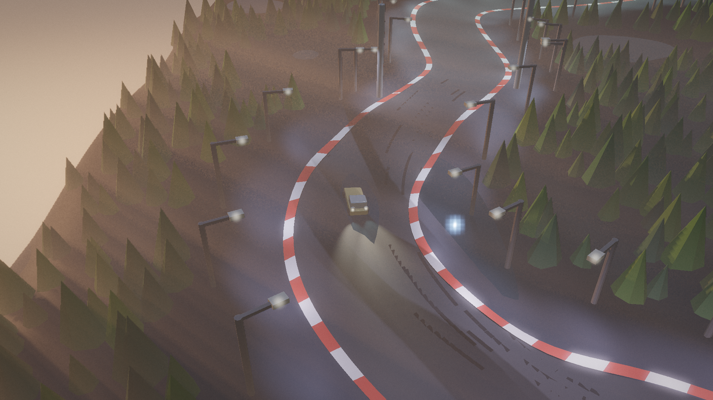

# Arena

A night circuit, on the game path of
[artshape-render](https://github.com/onion2k/artshape-render): drive a truck
round a lit track over rolling ground against three others, and try to take a
second off your best lap.

It was an arena shooter until the driving turned out to be the more
interesting half. The drones, the gun and the score are gone; the vehicle they
were standing on — suspension, tyres, and a floor with hills in it — is the
whole game now.



## Running it

```bash
npm install && npm run dev
```

Needs a browser with WebGPU.

| | |
| --- | --- |
| **A** **D** or ← → | steer |
| **W** or ↑ | throttle |
| **S** or ↓ | brake, and reverse once stopped |
| **R** | back to the line |
| drag | swing the camera round |
| wheel | in, or out until the whole circuit is in frame |
| **C** | put the camera back |

## The field

Four cars, the player's and three driven by the same line-follower that has
been testing the track since it existed. It reads the centreline the lap
counter reads — offset by its own preferred line, looking further up the road
the faster it goes, lifting and braking for whatever it cannot steer round.
No racing line solved in advance, no lap of practice, no memory of the corner
it is in.

A precomputed ideal line with a speed for every corner is what a serious
racing game does and would drive better than this. It would also be a second
description of the track, needing redone every time the circuit changed.

Two things it needs beyond following: a pull back toward the middle when it is
off the road, because a driver that runs wide and keeps its preferred offset
points further off it and ends the race beached on the inside; and a reverse,
because a car cannot steer without moving and is pushed straight back out of
whatever it hits, so without one a single bad corner ends its race where it
happened.

Cars are pushed apart and their closing speed exchanged. Not a real impulse —
no spin, no mass, nothing conserved — but enough that a car cannot be driven
through, and that being leaned on in a corner costs you the corner.

## The truck

It is a rigid body on four wheels, not a dot with a velocity. Every frame a
ray goes down from each wheel to find the ground; each wheel that finds it
pushes the body up through a spring and a damper, and that push is also the
load that wheel is carrying and so the size of the friction circle its tyre
has to spend. In that circle each tyre kills what sideways velocity it can and
drives or brakes along its own facing, and asking for more than the circle
holds is what makes a corner a corner. Everything is summed as force *and* as
torque about the centre of mass, so it dives, leans and pitches over a crest
without any of those being written down anywhere.

It steers rather than turning: the front wheels point, and a stopped car does
not rotate. Hold the brake once it has stopped and it reverses, which matters
more than it sounds — a car pushed straight back out of whatever it hits, and
unable to steer without moving, is wedged there forever otherwise. Space is
the handbrake, which is a different thing: it locks the back wheels and takes
most of their sideways grip, and is for pointing the truck somewhere other
than where it is going.

A wheel with no ground under it makes no force at all, so a jump is not a
special case: the springs run out of travel, the wheels stop pushing, and
gravity is all that is left.

It was too light, too slidy and too wide in a corner. What fixed each:

- **Light** was the springs. It sagged 13mm of its 26mm of travel standing
  still — half the suspension used up doing nothing — so the body floated and
  pitched at every input. At 305 it sags 8mm and a 60mm drop settles in 0.2s.
  Anti-roll bars took the lean out without taking the travel out, and the
  inertias carry a gyration factor, because a vehicle is not a uniform box:
  its mass is at the corners, and how long something takes to agree to change
  direction is most of what tells you it is heavy.
- **Slidy** was the tyres taking 90ms to decide, and not a shortage of grip.
  At 55ms they bite. Grip went up too, which mattered less than it sounds.
- **Short** it stayed until later. The wheelbase is 220 now and the body 300,
  a third longer between the axles than the 166 it was built with. A long
  wheelbase is a calmer truck and a wider turning circle, and the circle is
  the thing to watch: turn radius is wheelbase over tan of the road wheel
  angle, so 33% more wheelbase is 33% more radius on the same lock, and the
  circle at 1500 mm/s went straight from 443mm to 560 against a tightest
  corner of 568. That is no margin at all, and it is exactly the state the
  steering lock was raised to fix once before. Taking the lock from 0.62 to
  0.72 — 41 degrees at a standstill, the top of what a real rack gives — puts
  it back to 458/482/506mm at 900/1500/2100. The inertias are worked out from
  the body length, so lengthening it makes the truck slower to pitch and to
  change direction, which is most of what the extra length is for.
- **The turning circle** was the steering lock winding off too hard with
  speed. At 1500 mm/s it was leaving 0.116 radians, a 1426mm circle — wider
  than the tightest corner on the track, so that corner could not be taken at
  speed however much grip there was. It now keeps 0.23 radians and turns
  inside 800mm.

The brakes are deliberately weaker than the tyres. Grip alone stopped it from
full speed in sixty millimetres — a fifth of a truck length, in a tenth of a
second — which is not a brake but a wall, and it took braking out of the game
entirely: no corner had to be slowed for. Capped, it stops in 1.6 truck
lengths, and where to brake is a question again.

Together those took a lap from 8.65 seconds to 5.60, and the line-follower
that drives it from wandering 295mm off the centreline to 56.

### Then it turned out none of that was the limit

All of the above is about the car being heavy and precise, and it worked, and
the game still was not much fun to play. Measuring the thing nobody had
measured said why. On a full-lock skidpad at every speed the truck can reach,
it used **between four and fifteen per cent of the grip it had**, peaking at
0.31g of lateral acceleration against tyres worth 2.15. The tightest corner on
the circuit asks 0.87g at top speed. So the tyres were never the limit,
nothing could overdrive a corner, nothing a bump or a throttle did could
unsettle it, and the radius it turned in was decided by the steering geometry
alone. It was a slot car with a minimum radius, and the only input that
mattered was holding the wheel over and waiting.

Four things followed from that.

- **Grip came down to 1.35 and the steering falloff went up to 2600.** Full
  lock at 2200 mm/s now asks for 1.03g against the 1.35 the tyres have. Peak
  lateral went from 0.31g to 0.76 and grip use from 4–15% to 26–56%: the
  driver can ask for more than the car has, which is the only way a limit can
  be something you drive to. It cannot go much lower while the engine is this
  strong — the rear tyres have to be able to put 5800 down, and at 1.05 they
  could not, so a field of four spent 91% of a race stationary and spinning
  its wheels.
- **The rear tyres get 92% of the front's grip**, so the back lets go first
  and lets go progressively, and there is something to catch.
- **`gripAt` was wired in.** It had been sitting in the track module, fully
  written, called by nothing: the grass gripped exactly as well as the road. A
  racing line you are not punished for missing is not a racing line. It takes
  a third of the grip away over a 200mm shoulder, and off-track rolling
  resistance takes speed as well — needed because on a track defined as a
  radius about a middle, cutting the inside makes the lap *shorter*, and the
  fastest driver in the field was doing exactly that for a fifth of every lap.
- **A handbrake**, on the space bar, which is the one input that is not a
  request for more of something.

The measured result, over a two-minute four-car race: every car finishes, best
laps 14.18 to 14.82 seconds, no spins, no car stationary at any point, and
10.7% of the time with a wheel off the road. Solo, the four skill levels
separate by 1.7 seconds a lap.

### Drifting

Brake while turning, at speed, and the back steps out; keep the wheel
turned and the throttle on and it stays out until the wheel centres. That
is the whole input. Underneath it is the handbrake's mechanism — the rear
tyres give up grip, faded out with the slip angle so an angle cannot become
a spin — with a latch that outlives the tap, and one thing that is not
tyres at all: a servo on the slip angle, a yaw torque in the steering's
direction that runs out at an angle the steering sets, with damping against
the yaw rate. It is the one arcade assist in the physics, and measuring is
what made it necessary.

With the wheel held at full lock into the corner — the only way a keyboard
holds it — the truck rotates until its front tyres point along the way it
is going, and then they stop pushing: the body's slip settles at the lock
less the yaw's share, about 13 degrees, however little grip the rear has.
Cutting the rear from a fifth of its grip to a twentieth moved that by one
degree. A driver goes past it on opposite lock, and a keyboard cannot, so
the servo does the rotating instead and the fronts, pointing into a corner
the truck is going out of, hold it there. A fixed torque was tried first
and was either too little — the fronts are stiff, three degrees of slip is
force enough to cancel a kick of 24 — or too much, and the momentum carried
the truck through 150 degrees before the fade could catch it. Full torque at
no slip, none at the target, capped at 110 so a tap is a flick and not a
slam.

Measured, a brake tap of a quarter second at full lock then throttle with
the wheel held: peak slip **22 degrees** against 11 without the tap, held
between 10 and 19 under the throttle, no spin at 1200, 1700 or 2200 mm/s,
back straight in under a tenth of a second when the wheel centres, and the
drivers never trigger it — zero drift frames and zero marks from the field
in ninety seconds. It costs speed: the tap and the sideways scrub take the
truck down to 330 to 500 mm/s before the throttle brings it back, which is
what drifting costs a real car and is why nobody drifts to win. Nine
tunings got here, and the thing they kept finding was that the truck's
speed, not its angle, was what ended a drift: sideways at 38 degrees it
fell through its own speed gate in half a second, so a drift that is
going holds down to 300 where one may only start above 900.

### Rubber on the road

A sliding tyre on the tarmac leaves a mark: a thin dark quad from where the
wheel was to where it is, in a ring of two thousand — thirty-odd seconds of
sliding — with the oldest overwritten. They are an ordinary instanced group
with the darkest matte material in the arena, so they take the floods and
the shadows like everything else. Only on the tarmac, and never wet: a tyre
on the shoulder throws dust, and a tyre in a ford throws spray. A drift
round one corner lays about eighty. The smoke that goes with them was
already there, since the particles: a sliding tyre smokes.

### The handbrake is not a fast way round anything

It was swept over how much sideways grip it leaves the rear and how hard it
locks, and it never once turned the truck through more of a corner than
steering did: cutting the rear's sideways grip cuts the rear's share of the
cornering with it, so the truck rotates and runs wide at the same time. What
it buys is 45 degrees of slip angle that comes back the moment you let go,
for three quarters of the speed carried in. That is what a handbrake turn
costs a real car too, and it is kept on those terms.

Getting there took three wrong tunings, each of which is recorded in the
source where it matters:

- Left alone the handbrake took **99% of the speed away in seven tenths of a
  second** — a parking brake, not a drift. Its longitudinal force is capped
  now.
- That was also why it looked random. With the truck nearly stopped, any
  rotation at all reads as a slip angle of 180 degrees, so the same key gave a
  tidy 42-degree slide at full lock and an apparent spin at three quarters.
- Fading it out on the yaw rate rather than the slip angle sounded better and
  measured worse. It is on the slip angle, with full grip back by 60 degrees —
  well inside the 90 past which a tyre stops arresting a spin and starts
  feeding it, because once the truck is travelling sideways the direction its
  contact patch is sliding is along the truck rather than across it.

### The drivers

An opponent follows the centreline offset by a line of its own, and it now
does two things it did not. It **steers for a yaw rate** rather than
multiplying the heading error by a constant: that constant was chosen when
full lock at speed was 0.23 radians and could not spin anything, and with the
lock the truck has now it saturated at any error over 22 degrees and put full
opposite lock on at 2000 mm/s. And it **brakes for the radius ahead** rather
than for the corner it is already in — it reads how tight the track is far
enough up the road to stop from here, works out what the tyres will hold
there, and arrives already slowed.

That rule does not currently fire, and it is worth saying so rather than
leaving the claim standing. Measured over a lap since the wheelbase went up:
the driver is at **full throttle 100% of the time**, and its speed never gets
past 79% of the limit it works out, median 56%. The truck's top speed is below
what the tyres would hold in every corner on this circuit, so what limits a
lap is the engine against the drag, not the road. The rule stays because it is
the right one and because more power or a tighter corner would make it bite —
but nothing out there is being out-braked today.

It also aims at a point corrected outward by the sagitta of the chord it is
driving. A driver steering straight at a point on an arc passes inside that
arc — at the tightest corner here, 178mm of a track whose half width is 380 —
which is why the fastest car in the field spent a fifth of its lap off the
road on the inside of every corner. Correcting it took that from 20.9% to
9.7%, and the other three drivers to zero.

## The circuit

A closed loop 29 metres round, defined in polar form — a radius that varies
with the angle about the middle of the arena. That is a real constraint on the
shape, no hairpins and no figure of eight, and it buys something worth more:
the nearest point on the centreline to anywhere in the arena is the point at
the same angle, so **how far round the lap you are is `atan2(y, x)`, exactly,
for nothing.** No search along the curve, no accumulating error, and a start
line that cannot be crossed sideways.

A gantry either side of the line holds you for four seconds: five bulbs on
each post light in turn, all ten go out, and the clock starts. Nothing is timed before that —
a lap measured from whenever the page happened to finish loading is not a lap
time. The truck is held on its handbrake rather than frozen, so it settles on
its springs where it stands instead of being dropped there at the go.

A lap counts when that progress wraps forward past zero, and only if you have
been round the far side since the last one — so rocking back and forth over
the line counts nothing, and reversing over it un-arms the next lap rather
than scoring one.

The tightest corner is 568mm. The truck's steering lock winds off with speed,
so it turns inside 631mm at 1200 and 1015mm at full speed — which is to say
that corner has to be braked for, and a lap is a question about where.

Scaling a track up scales every corner with it, so a circuit three times the
size is three times easier to drive. A third and faster term in the radius
puts corners back in that are tight against the truck rather than against the
radius of the loop.

Everything about the track is measured along the radius, because that is what
makes the progress free — but the radius is only perpendicular to the track
where the track is a circle, and this one is not. Where the radius changes
fast the two are well apart, and a step outward along the radius is mostly a
step *along* the track rather than across it. Correcting for that is one
cheap factor, and without it the trackside posts sat far closer to the racing
line than their 640mm claimed: 437mm of real clearance at the worst corner,
against the 176 a truck and a post need between them. Off the
tarmac the grip falls away over 200mm rather than at a line, so running wide
is a mistake that costs rather than a wall.

### Behind the truck, on V

An experiment, and off by default. The overhead view is the game's own; this
puts the camera 1500mm behind the truck at 22 degrees above the horizon and
turns it with the nose.

It is driven through the orbit controller rather than around it — the mode
writes an azimuth every frame and leaves the polar and the radius to the drag
and the wheel, so how high and how far back the chase sits is still the
player's, and only which way round the truck to stand is taken away. The
controller's own easing is the camera lag, and measures at 5.4 degrees behind
the nose at 1.24 rad/s of yaw and 8.3 through a handbrake slide, with the
truck never leaving the middle of the frame by more than 0.03 of its width.

Two things had to be got right, and both were wrong first:

- The azimuth is kept as a **continuous angle, never wrapped into a turn**,
  and entering the mode picks the value nearest where the camera already is.
  The orbit eases toward what it is handed by plain interpolation, so an angle
  a full turn away from an identical one is a camera that swings the long way
  round to arrive where it could have reached in a fifth of the distance. It
  did exactly that: 4.95 radians, on a switch that should be barely a
  movement.
- The **lead is a third of what the overhead view uses**. 0.32 seconds of
  travel at racing speed is 590mm, which from 3900mm up and back is a nudge
  and from 1500mm behind is the truck off the side of the frame.

What it costs is what you would expect: from behind, the posts are in the way
and the road ahead disappears over every crest, so it is much harder to see
what the corner does before arriving. That is the trade the overhead view was
chosen to avoid, and it is why this is on a key rather than instead.

## The settings

Escape opens a panel of ten sliders: the ambient light, the floodlights,
the time of day, the top speed, the steering, how many drivers line up
against you, three for the picture rather than the scene — the bloom, the
vignette and the grain — and the dawn mist. They are
kept in one table in `settings.ts`, which is what the panel is built from —
adding a knob is one line there and none in the page — and they are read
live, every frame, by whoever uses them, so a slider moved mid-race takes
effect on the next step. They persist in local storage, and the button puts
them all back.

Each one is the constant it stands in for, made a lookup:

- **Ambient** is the renderer's `look.ambient`, which the frame uniform reads
  every frame, so it is written straight into the look.
- **Floodlights** is the intensity every trackside lamp is given when the
  light list is rebuilt, which is every frame anyway.
- **Time of day** is when the race starts. The clock runs on from there
  with the player's own progress, three hours a lap — not with the wall
  clock, so a driver who stops to look at the forest does not watch it dawn.
  A lap is about fourteen seconds, so a race of eight is a full day, and a
  field that sets off at 22:00 under the street lights sees them go out
  during lap three and finishes under the sun. Measured: 22:00 on the grid,
  01:03 after a lap, 04:02, 07:02 with the lamps off and the sky up, 10:03,
  13:02. Progress for this is a continuous count of the road covered, not the
  lap counter plus the lap fraction — the grid sits just short of the line,
  so that sum starts near one and *falls* as the car crosses, and a clock
  wants something that only runs on. `daylight.ts` turns the hour into
  everything the sky does: where the sun is, what colour, how much the environment lights
  the arena, what the sky looks like, and whether the lamps are on. The sun
  rises at six and sets at eighteen, comes up warm and goes white a fifth of
  the way up, and swings from east through the moon's quarter at noon to
  west. Below the horizon it is the moon — dim, cold, and from a fixed place —
  which is the light the night was always lit by, and the one thing the
  ambient slider does not scale. (It had a slider of its own for a day; the
  clock replaced it.)

  **By day the lamps are off.** The floods, the headlights, and the glows on
  the lamp heads and headlamps all follow the clock — off a little after the
  sun is up, on a little before it is down — so that a street light at noon
  does not happen. The starting lights do not: they are a signal, and a red
  light at noon still means wait. Measured: 92 lights at 22:00, 0 at 09:00
  and noon, 92 again by 18:30, with the dawn and dusk fades between.

  The sky is a table of keyframes over the sun's height, blended with a
  smoothstep between rows, because the first version was two states with an
  hour of blend between them and it looked like a switch: noon was 09:00 was
  16:00, 22:00 was 03:00, and the whole of dawn was over in a third of a lap.
  Now there is a deep night that lifts before the sun (ambient 0.04 to 0.12
  by 05:30), a horizon that goes orange while the lamps are still on
  (sunrise at 06:00: sun 1.4/0.5/0.2, sky 0.55/0.31/0.21, 92 lamps), a golden
  hour in which they go out (06:30, lamps at 0.6), a cool bright morning
  (ambient 0.83 at 08:00), a noon (1.0), and the same played backwards and
  redder through the evening, with the lamps coming on at 17:30 while the
  sky is still pink. The moon crosses the sky opposite the sun, so the glint
  on the road moves through the night too. The environment is swapped while
  the sky is still nearly black, at an ambient of 0.09: the two bakes do not
  match and a cut between them shows at anything brighter.

  Daylight here is mostly the environment. The renderer's sun is a highlight
  and not a lamp — it puts a glint on things and does not otherwise light
  them — so what lights the ground by day is the baked environment through
  `ambient`, and there are two environments, a dusk and a daylight one baked
  with its sun where noon puts it, swapped as the sun clears the horizon.
  The day ambient is 1.0; at 0.62 the arena at noon measured a frame-wide
  mean of 59 against 54 at night, an overcast afternoon at best, and at 1.0
  it is 88, with nothing blown out. It is a bright overcast day rather than a
  sunny one, and it cannot be the other with this renderer: a sun that
  lights the sunny side of a tree and not the shaded one needs a diffuse
  term the game shader does not have. That is a change to the library, held
  to the library's bar, and it is the next thing to do if the day is to look
  like one.
- **Top speed** sets the drag. The engine and the drag balance at the top, so
  `AERO = ENGINE / v²`; at the default 2300 that is the 1.1e-3 it was as a
  constant, and the acceleration feel is left alone. Measured over six
  seconds on the open floor: 1256 mm/s at a setting of 1500, 2347 at 3200.
- **Steering** scales the lock, for the drivers as well as you — they convert
  the yaw rate they want into an input using the lock in force, so they keep
  driving the same line whatever it is set to. The circle at 1200 mm/s is
  486mm at one, 754 at 0.6 and 358 at 1.5.
- **Opponents** rebuilds the grid — only when the count actually changes; the defaults button applies every control at once, and restarted the race for nothing until it checked. Every pool that holds a car is sized to
  eight once, and how many of it are live is the length of the car list,
  which is emptied and refilled rather than replaced so anything holding it
  keeps seeing the race. Seven drivers ran forty seconds with none stalled.
- **Dawn mist** scales the fog the clock decides on: see
  [The mist](#the-mist). At zero there is no mist at any hour, and it costs
  nothing.
- **Bloom**, **vignette** and **grain** are written into the renderer's
  `post` when they move. They change nothing in the arena, only the picture
  of it: see [The picture](#the-picture).

A slider with the focus owns the arrow keys, and the truck does not: the
same keystroke steering the car and nudging the ambient light is a panel
nobody can use.

## The minimap

The whole circuit in the corner, with a dot per car. Two dimensions and no
GPU: the track is an analytic curve, so its shape is an SVG path built once
at startup from the same function the wheels and the lap counter read, and
the only thing that changes from frame to frame is four pairs of coordinates.
A second render pass would cost a second pass; this costs eight attribute
writes.

## The camera

It follows the truck at a fixed distance behind it, leading it a little in the
direction it is going so there is more road ahead than behind. The circuit
does not fit on one screen and is not meant to: the view is about five metres
wide against twenty-nine of track, and the road scrolls past.
Zooming out to the whole circuit is still there for looking at the lap you
have just driven.

The distance is a length rather than a fraction of the arena, which is the
point of the change: how much road you can see should not depend on how big
the circuit happens to be. It used to be held on a leash whose length was how
much of the arena was off screen, which kept the whole thing in frame — right
when the whole thing fitted, and it no longer does.

## The ground

The tarmac is one ribbon of triangles following the centreline, and not a run
of slabs. Slabs were placed at even steps of arc measured on the centreline,
which is fine on a straight and wrong on a corner — the outer row spreads and
the inner bunches, so the road broke into scattered paving exactly where the
track turned. It is lifted 22mm above the terrain, which has to beat the
difference between two linear interpolations of the same curved surface at
different spacings: the ground is sampled every 85mm and the ribbon every 90,
which over the sharpest ramp is about five millimetres either way.

Under it is a field of shallow hills described by one function that the wheels, the ground
mesh, the tarmac, the posts and the walls all read. Nothing approximates
anything else, so the truck can never be seen floating over a hill or sunk
into one.

Each wave is a plain sine except the ramps, which are multiplied by a much
longer wave — an envelope — so that they appear in bands with rolling ground
between them rather than covering the floor. That envelope is cubed. A plain
sine one is above half for half of its cycle, which meant a ramp that was
exciting at its crest was a washboard everywhere else and the arena read as
corrugated iron: the median slope of the whole floor was 14 degrees, and it
was the ramps setting it. Cubed, it has fallen to an eighth of its height by
the midpoint of the cycle, and the median is 5 degrees with the 95th
percentile still 24 — a smooth floor with steep ramps in it.

Narrowing the bands moved them, though, and the one the circuit used to cross
came off it: the speed needed to leave the ground anywhere on the racing line
went from 1559 mm/s to 2373, which against a top speed of 2800 is no jump at
all. The envelope's length and phase were swept for a band that lands back
under the road without the floor going rough again. It needs 1443 mm/s now,
over about 5% of the lap, and a run over the crest at 2400 lifts all four
wheels for five frames and 48mm of daylight.

The kerbs are blocks laid down both edges of the tarmac, red and off-white
alternately, which is two meshes rather than one because material here belongs
to a draw. The tarmac and the ground either side of it are both dark, and a
change of shade at a grazing angle in the dark is not an edge you can drive
to; a banded strip that catches the floodlights is legible far enough ahead to
plan a corner. They stand 8mm proud of the road and nothing collides with
them.

### Then they turned out to be steep enough to strand a car

The ramps' flanks reached 29 degrees and the tarmac 32. A car on the shoulder
either side of the road cannot climb past **23.5** from a standstill — the
reduced grip out there leaves the rear tyres unable to put the engine down —
so a car that ran a little wide onto a ramp flank and stopped, stayed, wheels
spinning. The drivers found it reliably.

A sine's steepest gradient is A·2pi/L and its curvature at the crest is
A(2pi/L)². One is what strands a car and the other is what throws it, and they
are not the same number, so shortening the wave and taking the amplitude down
with it moves them apart. At 36 by 720 the steepest ground within a truck's
width of the road is 21.9 degrees against 32, the arena's worst anywhere is
22.1 against 32.9, and none of the thirty steepest spots beside the road holds
a car that stops on one — the slowest climbs away to 1467 mm/s. A three-minute
four-car race runs 12 to 13 laps a car with best laps of 13.40 to 13.90 and
**nothing stationary at any point**, against 14.15 to 14.82 before.

The jump is the price, and it was not recoverable:

- The amplitude cannot simply be dropped to buy the curvature back: at 26 of
  amplitude the crest condition said the truck should fly at 1716 mm/s, and at
  2300 it did not lift a wheel. (The reason first given here was that the
  springs absorb a crest no taller than their travel. That was wrong — see
  below.)
- Nine (amplitude, length) pairs were measured across the whole range that
  keeps the slope under 25 degrees. Not one got all four wheels off the ground
  at a speed the truck can reach.
- Making the shoulder climbable instead does not work either. With it softened
  from taking a third of the grip to taking a seventh, and the old ramps put
  back, seven of the thirty steepest spots beside the road still held a
  stopped car. The limit is the engine against the truck's weight on a slope,
  not the surface.

#### Why it cannot jump, corrected

It is not the suspension travel, which is what this file said first. `TRAVEL`
is the clamp on how far a spring may be *squashed*; the reach that decides
whether a wheel is touching is `REST + WHEEL_RADIUS` below the mounting point,
and `TRAVEL` does not appear in it. Measured at 26, 45 and 70 over the sharpest
crest on the circuit, the three runs are identical frame for frame. Droop is
the quantity that matters and it works the wrong way round — more of it holds
the wheels down, and even at a droop of 10mm, which is a very harsh truck, all
four came off for a single frame.

What stops it is the truck's own length. One wheel lifts easily: there is 8mm
of static sag, so the body need only rise that far. For all four to lift, the
ground has to fall away from the whole 250mm of it at once, and over any crest
gentle enough to be safe the truck pitches through instead — nose up on the way
in, which plants the rear, then nose down over the top, which plants the front.
Logged over a purpose-built ramp: front wheels at zero compression while the
rear read nine, and by the time the rear reached zero the front was back down.

Purpose-built ramps were tried, on the tarmac only, where the surface allows 31
degrees rather than the shoulder's 23.5 — twelve shapes, including asymmetric
ones ending in a lip. The lip does get all four wheels off. For one frame. That
is a flick, not a jump, and it costs 27 to 32 degrees of slope on the racing
line, so it was taken out again.

And the thing that makes the trade easy: **that same race, measured on the old
steep terrain, never got all four wheels off either.** The jump only existed in
a straight line at 2400 mm/s in a test, never in a lap. What this gives up is
very nearly nothing that was being had; what it buys is a race-ending bug.

The ramps in it are sized against the truck rather than for the look. A wheel
leaves a crest when v²·κ exceeds gravity, but the climb is paid for out of the
same speed, so for each wavelength there is a best height and a lowest
approach speed that can clear it at all: 520mm wants 1800 mm/s, 650mm wants
2015, 820mm wants 2263. They are 650 by 52 against a top speed of about 2400.
Nothing shorter, whatever it would do for the jumps: at three wheelbases the
axles sit on opposite phases of every ripple and a truck that should be riding
a hill is being shaken by a washboard.

## Shadows

The sun casts, and so do the eight street lights nearest the truck. Both
are the renderer's, from v0.6.0 of `artshape-render`: the game shader's sun
was a highlight only until then, and a day on it was a bright overcast one
lit by the environment. It has the same quarter of matte the point lights
always had now, and one orthographic shadow map fitted round a box the game
names — the whole arena and its apron, up to the tallest tree — read through
four hardware-compared taps. Up to eight spotlights carry a perspective map
each; the game hands the renderer the pool indices of the floods nearest the
player's truck, nearest the truck rather than the camera because the shadows
that matter are the ones you drive through.

What it costs, fenced at 1080p, median of three: **1.3ms at night** — the
sun's map, eight spot maps at 512, and the lookups, on a 2.8ms frame — and
**0.16ms by day**, when only the sun's map is rendered, on a 0.25ms frame.
The maps are rendered every frame over every triangle in the arena, which
was 390k when they arrived and is 115k now: the lamp posts were three
bevelled parts from the jewellery library each — 1,930 triangles a post,
162,000 across the circuit, 42% of everything the maps drew, for bevels
nobody could see from the road — and are a prism and two boxes now, 48 a
post. The wall of blocks round the arena, 119,000 more, is gone; the forest
is the edge, planted straight out to the apron, and the trucks are still
held inside by the clamp that always held them. Night went 4.09ms to 3.64,
noon 0.40 to 0.30.

What it looks like is measured too. At noon the shadows shift the frame's
mean brightness by under one per cent — the sun is nearly overhead and every
tree's shadow is under the tree. At 08:00, with the sun at 33 degrees, they
turn 5.7% of the frame dark and drop the mean 3.7%: lamp posts across the
road, lit and shaded sides on every tree, the trucks' own under them. The
evening is the same the other way round. By night the moon casts, faintly,
and the lamps cast hard — a post's own shadow across the road under it, and
the trucks' as they pass.

The tests for all of this live with the library: a box over a floor, the
floor in its shadow darker than beside it, for the sun and for a spotlight.

## The water

One level, everywhere: ground below it is under water, and so is road. The
level is not chosen by hand. It is the lowest the road surface gets round
the lap plus twenty millimetres, so the dips in the circuit are fords — the
road runs into the water for a truck length or two and out again, three
times a lap (514, 475 and 223mm) — and the same level carried across the
arena floods every hollow in the forest into a lake, 7.8% of the ground.
The forest is planted only on ground 30mm clear of it; 580 trees went, and
none stands in water. The lakes and the fords are on the minimap too, as
squares of a 150mm grid whose ground is under the level, drawn over the road
so that where the road goes into the water on the ground it goes into the
water on the map.

The water is one quad at the level, opaque, near black and nearly a mirror:
what makes it read as water is what it reflects — the sky by day, every lamp
on the shore as a hard glint by night — and the shadows the trees lay across
it. Opaque, because the renderer has no transparency and this was not the
change to give it one; a ford is therefore a place the road vanishes and
reappears, which from above a real one is too. It costs nothing measurable:
two triangles, and the night frame read 3.03ms against 3.09 before it.

A wheel in the water drags — a sixteenth of a gravity with all four wet,
about 150 mm/s over a half-metre ford — so a ford is felt, not just seen.
The first version measured wetness against the terrain, and since the
tarmac is drawn 22mm above the terrain the wheels ride on, the truck read
wet for a sixth of every lap on road that was dry to look at, and lost five
or six hundred a ford. Against the road surface it is 5.5% of the lap, and
the drivers' best laps are what they were: 13.6 to 14.2 seconds, six laps in
a hundred seconds, nobody stranded.

## Smoke and spray

The trucks throw things up: smoke off a sliding tyre, spray off a wet one.
Both are the renderer's GPU particles, from v0.7 of `artshape-render` — a
fixed pool of thirty-two thousand in a storage buffer that never comes back
to the CPU, filled as a ring, moved by a compute pass and drawn as
camera-facing quads. The game's whole part is a burst a wheel a frame: where,
how many, how fast, how long, what colour. The physics already knows whether
a wheel is on the ground, how hard it is sliding and whether its ground is
under the water, so `particles.ts` reads those and asks.

Spray is additive — droplets thrown up and forward off the tyre, falling
under gravity and dying where they meet the water again, with a little
translucent mist that hangs. Smoke is translucent, from the contact patch,
drifting with a share of the truck's motion and swelling as it thins. Both
are tinted by the time of day, because the particles are unlit: smoke that
was white at noon would glow white at midnight over a road that is nearly
black, so at night it is a grey haze in the floods.

What it costs: nothing at rest, and less than the measurement noise busy. A
race keeps about seven hundred slots of the ring live, peaking at fifteen
hundred, and the night frame at 1080p read 3.004ms with the pool against
3.006 without it. Twenty thousand live particles moved it by less than the
0.3ms the same measurement wanders by on its own. It was not free at first:
the update and the draw walked every slot of the ring every frame, which
cost 0.84ms for a pool holding a few hundred, until the passes were confined
to the run from the oldest burst that could still be alive to the cursor —
and that run was wrong once the ring had been lapped, reading the remainder
past the wrap, until the cursor was kept unwrapped. Both are the library's
now, and tested there.

## The forest

Everything that is not the road or its shoulder is trees: 1784 cones, in
shades of green, one mesh drawn once. A tree is seven flat-shaded triangles,
and everything that makes one different from the next — where it stands, how
tall, which green — is its placement matrix and four floats of material, so
the whole wood costs the GPU 0.26ms of a 2.97ms frame at 1080p and one draw
call.

They are planted on a jittered grid rather than at random, because a forest
has no clumps of five trees in one spot and no bald patches. They start just
behind the lamp posts — the nearest trunk a truck can reach is 985mm from the
centreline, against the 884 the drivers have ever managed — and there is a
second ring beyond the wall, on the apron the ground runs out to, which a truck
can never touch and which turns the edge of the arena into the edge of a wood
rather than of the world.

The first planting started 900mm past the tarmac, and left a bare strip a
truck and a half wide between the posts and the first tree. On the outside of
the circuit, where the road bulges to within 180mm of the wall, that strip was
most of what there was, and the forest read as a hedge in the distance.

They are solid: a truck that reaches one is pushed out and bounced, the way it
is off a lamp post. Sixteen hundred of them against eight trucks is thirteen
thousand distance checks a step, which measures at 0.067ms for the whole step
and is not worth a grid. A hundred and fifty seconds of racing with the wood
there: every car ten laps, nothing stalled.

## The light

Eighty-four floodlights on the trackside posts light the circuit and nothing
else, which is what makes the track read as a track: the environment
contributes 0.035 of what it would and the sun is nearly off. They used to
sweep, which was right when the game was about finding things in the dark and
is wrong now — a driver needs to know what a corner does before entering it,
and a light that will be pointing elsewhere by the time you arrive is worse
than no light.

### They are street lights, and they stand back

They were eight-sided columns 88mm across with a floodlight balanced on top,
standing 260mm from the edge of a road 760 wide — at the scale of this arena,
a row of chimneys on the shoulder, and the circuit read as a corridor.

A lamp post is three pieces now: a slim pole, an arm out over the road, and a
head on the end of the arm. That shape is the point and not the decoration,
because it is what let the posts move: **a light on top of a column has to
stand where the light is wanted, and a light on the end of an arm does not.**
So the poles went from 260mm off the tarmac to 470 and the mast went from
88mm across to 34, while the lamps themselves stayed within 30mm of where
they had always been — the cone from each still crosses the full width of the
road with about 190mm to spare, and the circuit is lit exactly as it was.

Which way a post's arm reaches is now a property of the post rather than
something worked out from its position in a list. It had been derived from
the index in two different files, and one of them had the parity backwards
for a while: half the floodlights spent that time lighting the empty middle
of the arena while the road beside them stayed dark. There is one definition,
`lampAt`, and the arm, the head, the beam and the glow are all placed from
it, so a head is never anywhere but on the end of its own arm.

The alternating tall-and-short posts went with them. That was a depth cue
when they were columns; a row of street lights of two different heights just
looks wrong, so they vary by six per cent instead of forty.

The head of every post is drawn as a glow as well. A post is lit by its own
flood from directly above and so is barely lit at all: the outer row stood as
black poles against a black arena, which is clutter rather than scenery, and a
line of lamps running away round a corner is the strongest thing in the scene
for showing where the track goes before you get there. They are glows and not
lights — nothing is being lit, only seen — which is a screen-space quad each
against a light's whole shading loop. The kerbs and the eighty-four post heads
together cost 0.16ms of a 2.65ms frame at 1080p, measured fenced, median of
five.

The truck carries two headlamps that wash the road ahead, an exhaust glow
under power and brake lights, all bolted to a body that pitches and rolls, so
they are placed and aimed in its frame rather than on a plane at zero.

## The mist

Ground fog is a dawn thing, and for a reason worth honouring: the ground
loses heat all night, by the small hours it is colder than the air over it,
the air against it cools past its dew point, and the water comes out as mist
— which lies in the low ground, because cold air is heavy and runs downhill.
Then the sun comes up and burns it off. So the arena's mist thickens from
two o'clock, is at its worst from half four to seven, and is gone by half
nine, which is `mistAt` in `daylight.ts` and is the only thing that decides
whether any fog is marched at all. The evening is deliberately clear: mist
does form at dusk over water, but the ground is still warm and it is a
fraction of what dawn gives you, and two mists a lap would make the whole
thing ordinary.

It is the renderer's volumetric fog, which marches the view ray rather than
fading things toward grey by distance, and the two things that buys are the
two things worth having. It **lies in the hollows**: the density falls off
over a height above a base, and the base is the water level, so the mist is
thickest on the lakes and in the fords and thins out over the rises. And it
**takes the shape of what stands in the light**: every step of the march
asks the sun's shadow map, which the arena already draws for the ground, so
the forest lays shafts across the road instead of a wash over it.

The layer is **300 deep**, and that number is the whole difference between a
haze and a wood with the sun coming through it. A tree here is 300 tall,
and the first version put the layer at 520: two thirds of the mist stood
above the canopy in permanent sunlight, and the forest held **9%** of the
light out of it. Dropped under the tree line, the same forest holds **22%**.
Measured with the fog's own ambient and its forward scattering turned off,
so that what is being compared is the sun's light alone, with the shadow
maps on and off.

The rest of the numbers: density 2.6e-4 a millimetre at the base, which is a
beam down to half over about 2700 — a truck two corners away is a shape and
not a truck. Forward scattering at 0.62, so the mist glows where you look
into the sun and stays flat where you look away from it, which is why the
frame at six o'clock is warm on one side and cold on the other. An ambient
term of 0.16 plus half the sky's, standing in for the light the mist gets
from the sky rather than the sun, and the thing that keeps the shadowed half
of it a cold blue rather than black. A reach of 9000 and 28 steps, dithered
per pixel and per frame, marched at half size.

The reach used to show. A march that ends because it ran out of reach rather
than because it ran into something stopped dead, so the mist reached full
strength nine metres out and went no further — and the set of points nine
metres from the eye is a sphere, which is an arc ruled across the frame,
straight enough from a high camera to look drawn on. The renderer now ramps
the density down over the last third of the reach; in a still test scene that
takes the sharpest step in the fog from 8.2 levels to 5.1 against a range of
40. Worth knowing if the mist is ever retuned: raising `reach` costs steps,
because the march always takes `steps` of them however far it goes, and
lowering it brings the taper close enough to see as the mist thinning too
early.

**What it costs: 0.14 to 0.36 ms** at 1920×1080 depending on how much of
the frame is mist, and 0.52 at 2560×1440, and only between two and half
nine. At every other hour the density is zero, the
passes are skipped, and the frame is exactly what it was.

One thing it does not do: the floodlights do not light it. The mist is lit
by the sun and the sky and nothing else, so a lamp at dawn has a glow on its
head and no cone under it. Ninety-two lights sampled at every step of every
march is a different order of cost from one, and the hour the mist is thick
is the hour the lamps are going out anyway.

## The picture

The frame is not shown as it is rendered. The renderer's composite pass —
the one that always turned the HDR frame into a displayable one — now has
a chain in front of it, and the arena turns three of its knobs.

**Bloom.** A bright pass reads the frame at a quarter of its size and keeps
what is over a threshold of 1.0 in HDR, with a soft knee under it so a light
does not switch its halo on as it crosses a line; two passes blur that each
way through a nine-tap Gaussian; and the composite adds the result back
onto the frame *before* the tonemap, so a light clipped to white in the
frame spills its colour rather than a grey. Quarter size because bloom is
by definition soft, and a blur at full size is sixteen times the work for
an edge nobody can see. What it does here is what it is for on a night
circuit: the lamp heads, the headlights and the glint of the lamps on the
water all carry a halo that falls off past their own edge. Measured on the
headlight pool at the grid, in rings six pixels wide out from its brightest
pixel, at 0.35: 200 to 234 at 18 pixels out, 166 to 209 at 24, 136 to 164
at 30, 113 to 123 at 36, and the same by 48 — the halo is about a tenth of
the glow's brightness spread over thirty pixels, which is the number that
sets the default. The lamp heads, being a dozen pixels across, get a few
levels each; at 1.5 the picture is haze, and at a threshold of nothing the
road blooms too (frame mean 55 to 82), which is what the threshold is for.

**Vignette.** The corners darkened, after the tonemap and before the
gamma, by a smoothstep on the distance from the middle over the
half-diagonal, so a corner is one whatever the frame's shape. At 0.3 the
top-left sixty pixels go from 33.7 to 28.7, which is the picture drawn
toward the truck and not a thing you would point at.

**Grain.** A hash of the pixel and a time that rolls, added to the
*displayed* value and weighted by four times the luminance times one minus
it, so it is strongest in the midtones and nothing in the black and the
white, like film. It was added under the gamma first, and every black pixel
it landed on came up a grey: a night sky at 0.03 read as a haze of 13
levels, and the library's particle tests, which take a black frame as their
zero, failed on it. The weighting is why the sky is still black.

All three are the library's defaults (0.35, 0.3, 0.03); the sliders are
there because they are taste, and the ranges go to where the taste runs
out. The chain costs **0.1 ms** at 1920×1080 (2.83 to 2.96 ms a frame at
night, twice), and at 2560×1440 it is inside the run-to-run noise of that
frame (4.5–5.0 off, 4.6–4.7 on). Bloom at nothing skips its three passes;
the renderer's `economy.post` turns the whole chain off.

## What it costs

Measured on a Mac mini (M-series) at 1920×1080, fenced on the queue rather
than timed off `requestAnimationFrame` — a browser tab that is not being
composited stops calling back, and reads as a scene that mysteriously got
slower. `measure(width, height, frames)` is on the console for repeating it.

| | lights | ms a frame |
| --- | ---: | ---: |
| the circuit, driving | 31 | 1.18 |

Less than half what the shooter cost, which was 2.63 ms: the crowd is gone,
and with it the tracers, the explosions and the searchlight. A frame at sixty
is 16.7 ms. Nearly all of the 1.18 is the floodlights, which burn whether the
truck is moving or not.

The CPU side is **0.02 ms** a step, almost all of it the vehicle — four
substeps of a rigid body on four suspension rays.

Do not read the frame rate in the corner as the cost of any of this. It is
wall-clock between `requestAnimationFrame` callbacks, and a tab the browser is
not compositing stops calling back — which shows up as a scene that
mysteriously got four times slower while the GPU was doing the same work.

## Layout

| file | |
| --- | --- |
| `src/main.ts` | wiring: device, meshes, pools, the frame loop, the camera |
| `src/game.ts` | the race: the truck, the walls, the lap and the clock |
| `src/vehicle.ts` | the truck: suspension, tyres, a body with mass |
| `src/track.ts` | the circuit, and where on it a point is |
| `src/terrain.ts` | the ground, as one function everything reads |
| `src/scene.ts` | the parametric parts and where the static half stands |
| `src/lighting.ts` | the light list and the glow list, rebuilt every frame |
| `src/matrix.ts` | placements, and projecting a point to the screen |
